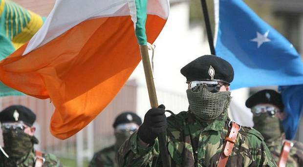

Despite difficulties, the Good Friday Agreement of 1998 has established a lasting peace in Northern Ireland over the last 20 years. In the aftermath of the Brexit referendum, and with the UK preparing to leave the EU, questions have arisen over the future of the Irish border. Despite British Prime Minister Theresa May’s promises, a hard border in Ireland has again become a real possibility, and the consequences of such a scenario could be dire. Dissident republicans and loyalist groups alike may seek to exploit this instability and stoke tension, possibly leading to an increased level of violence in the next few years.

In this article, we will briefly discuss the long and painful process involved in reaching the agreement that would set the stage for long-term peace in Northern Ireland, and we will examine potential negative consequences of Brexit in Northern Ireland. We will pay particular attention to the threat that peace in Northern Ireland faces from paramilitaries on different sides, including dissident republicans and loyalists.

After years of negotiation, the Belfast Agreement (or Good Friday Agreement) was reached in 1998 and made effective in 1999. This set the stage for long-term peace in Northern Ireland following decades of political and sectarian violence. In almost 30 years of constant bombing and shooting incidents that prompted military occupation by the British armed forces, over 3,500 people were killed, the majority of them being civilians. According to research conducted by the Poverty and Social Exclusion research project in the UK in 2002-2003, 45% of all adults in Northern Ireland experienced either the death or injury of someone they knew personally.

David Trimble, leader of the Ulster Unionist Party, and John Hume, leader of the Social Democratic and Labour Party, winners of the 1998 Nobel Peace Prize for their role in reaching the Belfast Agreement.

Under the terms of the Good Friday Agreement, Northern Ireland would have its own parliament, known as the Assembly, and its own government, known as the Executive. In addition, paramilitary organisations pledged to disband and decommission their weapons. While there have been obstacles and stumbling blocks in the intervening years, the level of violence in Northern Ireland has fallen dramatically, and a lasting peace has taken hold.

However, numerous issues still remain, chief among them the status of the Irish border, which has been open and free of barriers, and has become for all intents and purposes invisible. The decision by British voters to leave the European Union has raised troubling questions about the future of the Irish border, and it has become a central point of contention between British, Irish and EU officials in the negotiations that will decide the future of the relationship between the United Kingdom and the EU.

In June 2016, the British referendum to leave the EU passed by a slim majority. In March 2017, British Prime Minister Theresa May triggered Article 50 of the Lisbon Treaty, officially signaling the country’s intent to leave the EU and beginning the process of negotiating the terms of post-Brexit relations. The EU, acting on behalf of Ireland and its other member states, pushed for the UK to make a firm commitment to avoid a hard border in Ireland. In addition, the EU refused to budge on other Brexit-related matters, including the amount the UK would have to pay to leave the union, as well as the issue of EU citizens’ rights in the UK after the country’s exit from the union. In October 2017, EU chief negotiator Michel Barnier warned that Brexit negotiations were facing a “deadlock” due to the lack of progress on these issues.

After weeks of negotiation, a deal was reached on December 8th 2017, in which the UK affirmed its “commitment to the avoidance of a hard border, including any physical infrastructure or related checks and controls.” This was met with great relief in Ireland, with Irish Prime Minister (Taoiseach) Leo Varadkar declaring that the deal was "what we sought to achieve".

On March 2nd 2018, Prime Minister May gave a major speech about the progress of Brexit negotiations and the plans for post-Brexit relations with the EU. In this speech, May outlined a number of issues that would be the focus of future negotiations, including the status of the Irish border. She proclaimed that “we don't want to go back to a hard border in Ireland. We have ruled out any physical infrastructure at the border, or any related checks and controls.”

Such rhetoric does not match with May’s stated aim of not only leaving the EU, but also the single market and customs union. By ruling out the freedom of movement for goods and labour, the British government has limited options on keeping the Irish border open.

For its part, the EU has proposed that free movement of goods and labour continue to apply to Northern Ireland, with customs checks to be conducted in Northern Irish ports before continuing to other parts of the UK. This has been flatly rejected by May, who expressed concern that such a measure would "threaten constitutional integrity by creating a customs and regulatory border down the Irish sea." Early in March 2018, a report emerged that the British government was considering a plan that would require visitors to register in advance before crossing the border from Ireland into Northern Ireland. Taoiseach Leo Varadkar has rejected this proposal.

With the British government’s actions so far failing to line up with its promises, fears have again arisen of a hard border returning to Ireland, in spite of the agreement made in December 2017. While much of the of the discussion regarding a hard border in Ireland has focused on the economy, there is also fear that paramilitary groups may exploit the situation and step up campaigns of violence. Such concerns have been downplayed by various factions, and even some former IRA members have claimed that a hard border would not result in a renewed campaign of violence. Nevertheless, there exists evidence that highlights increased activity among dissident republicans and loyalists alike.

##Dissident Republicans

In 2014, Forbes reported that the Real IRA was one of the top 10 wealthiest terrorist organisations that year, with an annual income of $50 million. This income has largely been acquired through private donations raised in the US and by sales of illegal cigarettes in the UK. The Real IRA, a splinter group formed from the Provisional IRA, has been responsible for some of the worst atrocities in Northern Ireland, including the Omagh bombing of 1998 which killed 29 people. In 2012, the Real IRA merged with vigilante group “Republican Action Against Drugs” (or RAAD) and renamed itself the “New IRA”.

Despite this merger, the IRA’s operational capabilities have been severely curtailed due to strong cooperation between police forces in Ireland. In addition, a general lack of appetite for violence on the part of republicans has helped to keep the rate of violence down. In January 2018, a small dissident republican organisation, Óglaigh na hÉireann, announced an immediate ceasefire, having conducted a small-scale campaign since 2009 that involved car bombings and shootings targeted mostly at the Police Service of Northern Ireland (PSNI).

Dissident republican parade in Northern Ireland.

Nevertheless, police on both sides of the border continue to make frequent arrests and have found large quantities of weapons. In June 2017, two dissident republicans were arrested and were discovered to be in possession of 6 kilograms of semtex explosives and detonators.In December 2017, the United Kingdom’s domestic counter-intelligence agency (MI5) reported that Northern Ireland had the highest level of terrorist activity “probably anywhere in Europe”, and noted that they had disrupted 250 attacks through seizures and arrests. Despite numerous successful operations, MI5 have expressed concern that the “IRA retains access to terrorist material that includes firearms, ammunition and explosives”. Security analyst and former Irish army officer Declan Power claimed that “security forces will be looking at... the effects of Brexit and the potential security issues with its effect on the well-being of the people of the north.”

##Ulster Loyalists

The potential for loyalist violence is also cause for concern. Throughout the course of the Troubles, an ethno-nationalist conflict in Northern Ireland that lasted from the late 1960s to the late 1990s, loyalist paramilitaries were responsible for the deaths of over 1,000 people, and almost half of all civilian deaths. While claiming to defend Protestant communities from sectarian violence, loyalist groups targeted Catholic civilians almost exclusively, regarding the entire Catholic community as potential allies of the IRA.

It is worth noting that while the majority of Northern Ireland voted to stay in the EU, the vote was nonetheless largely divided on unionist and nationalist lines. In other words, unionists, who are in favour of Northern Ireland remaining in the UK, were more likely to vote to leave the EU than nationalists, who are in favour of Northern Ireland leaving the UK and uniting with the rest of Ireland. With this is mind, it is easy to imagine a scenario in which loyalist groups react violently to republican action against a hard border in Ireland.

While the main loyalist paramilitary, the UVF (Ulster Volunteer Force) decommissioned its arms as part of their obligations under the Good Friday Agreement, a number of loyalists rejected this move and formed splinter groups that have remained active. In addition, the main loyalist paramilitaries, while inactive, have not disbanded. From 2012 to 2013, the UVF were involved in a number of riots in Belfast targeting police officers and local Catholic residents. In one particular riot orchestrated by the UVF, up to 52 police officers were injured by rocks and petrol bombs thrown by the loyalist rioters.

An armed campaign like that of the Troubles would be difficult for loyalist groups to conduct, given the large-scale decommissioning of weapons and ammunition, as well as effective policing tactics. However, it would still be possible for loyalist groups to stoke tensions and commit acts of violence with more rudimentary weapons like petrol bombs and melee weapons, which the UVF has done before. If the cycle of violence were to continue long-term, this would create a stronger demand for military grade weapons like assault rifles and explosives, increasing the risk of escalation in violence.

Since its implementation in 1999, the Good Friday Agreement has largely succeeded in its goal of establishing long-term peace. However, it has proven to be vulnerable at times. From 2002 to 2007, the Northern Ireland Assembly was suspended, and the country was ruled directly from London, due to the failure of political parties to form an Executive. The largest unionist party, the Democratic Unionist Party, and the largest nationalist party, Sinn Féin, have failed to form a government since the Northern Ireland Assembly election in June 2017. Continued failure to form a government may again force the British government to suspend the Northern Ireland Assembly and impose direct rule. If this becomes the case, the reintroduction of a hard border in Ireland could put Northern Ireland along a path that could lead to an increase in tensions and risk of violence.

 