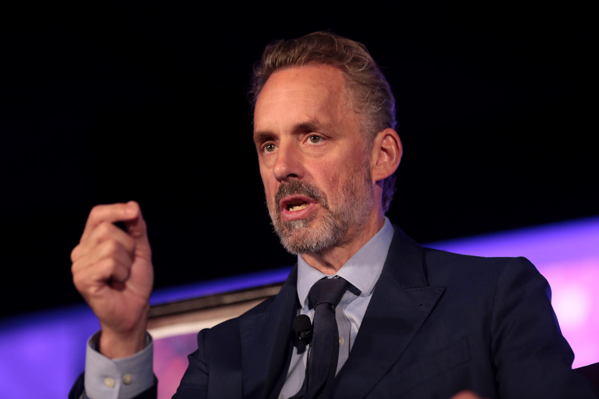

Canada, like most liberal democracies around the world, places freedom of expression as one of its most important human rights, protected by Section 2 of the Constitution Act, 1982. However, also like most liberal democracies, freedom of expression is subject to certain limitations in Canada. Section 1 of the same Constitution Act states that rights and freedoms are subject to “such reasonable limits prescribed by law as can be demonstrably justified in a free and democratic society.” The question of what constitutes “reasonable” under the law has been raised again this year, in the aftermath of the enactment of the controversial “Bill C-16” and its effects on freedom of expression. In this piece, I will be examining the law’s first major controversy, and what we can all learn from the mistakes made by the Canadian federal government.

##‘An Act to amend the Canadian Human Rights Act and the Criminal Code (Bill C-16)’

Bill C-16 was proposed with the goal of increasing protection of transgendered people from discrimination and violence. The bill prohibits discrimination based on sexual identity, and adds stiffer penalties to people who commit violent acts on transgender people based on their sexual identity. Opponents of the bill were concerned about vague terms such as “gender identity” and “gender expression” being employed, rather than specifically protecting transgender people. They feared that such vagueness would leave the bill vulnerable to abuse by those who wish to silence debate. In addition, critics were also worried that the law would mandate the usage of pronouns chosen by the protected class, and that refusal to use such pronouns could lead to loss of employment, fines, and even imprisonment. This bill marked a significant change in the way freedom of expression is restricted in Canada, in that it mandated the use of certain words; a huge escalation in restricting freedom of expression.

Prime Minister of Canada, Justin Trudeau.

##Controversy at Wilfrid Laurier University

After much debate, the bill was enacted in June 2017, and just five months later, it has run into its first major controversy. A teaching assistant at Wilfrid Laurier University named Lindsay Shepherd showed her class a short clip of University of Toronto professor Jordan Peterson arguing against the bill. She was then brought before a tribunal of professors and censured for showing the clip to her class. Nathan Rambukkana,  head of the tribunal, claimed that by arguing against Bill C-16, Professor Peterson’s argument was now in violation of Canada’s Human Rights Code, and that showing the clip violated the university’s policies. After a secret recording was leaked to the press about this event, a national debate has sparked on the issue of freedom of expression, with even the leader of the Conservative Party, Andrew Scheer, weighing in.

Eventually, the university apologised on behalf of the staff involved for their conduct, and Nathan Rambukkana himself published an open letter containing his own apology. The teaching assistant Lindsay Shepherd has expressed doubts about the apology’s sincerity, noting that if the meeting hadn’t gained so much media attention, no apology would have been forthcoming. In addition, the university made no commitment to protect freedom of expression in the future, attracting the ire of free speech proponents.

In the aftermath of this incident, we are now seeing renewed debates on Bill C-16’s merits and flaws, as well as the role of free speech in Canada. Defenders of the bill have argued that Rambukkana misinterpreted it, and that it does not overly restrict freedom of expression. National Post contributor, Brian Platt, argues that the threshold for violating the bill is high, and that discretion to prosecute lies with the attorneys general of the Canadian provinces. He also points out that in the cases of universities, it is the provincial governments who hold jurisdiction, not the federal government. Platt then goes on to undermine his original point by admitting that “nobody knows for sure” if presenting Professor Peterson’s arguments against the bill would violate the Ontario Human Rights Code, which is very similar to the Federal Code, now that the bill has been enacted. This level of uncertainty regarding the limits of the law confirms critics’ fears that it can easily be abused to silence debate.

Nevertheless, we are still seeing support for such restrictions on speech, not only by the high ranking politicians who passed the bill, but also by social justice activists and professors. The ‘Rainbow Centre’, which advocates for the LGBT students on campus, published a statement in support of Rambukkana’s conduct even after his apology and the apology of the university. Further, the statement argues that the university isn’t doing enough to silence debate on the use of pronouns, or what it calls “climate of transphobia”. Additionally, Ryerson University associate professor, May Friedman, stated that she believed that Lindsay Shepherd did not deserve to be reprimanded, but that nevertheless, “I think that the whole conversation [regarding the use of pronouns], at the same time, needs to be shut down.”

Both statements express the unconscionable position that certain debates should not be held, for fear of “harming” and “hurting” classes of people protected in provincial or federal Human Rights Codes. Not only this, but the law now compels people to say certain words, or risk losing their job, being fined, or even imprisoned. This dangerous position has manifested itself in the conduct of the Wilfrid Laurier tribunal, who reprimanded Lindsay Shepherd for merely showing a clip of a debate on public television, and this may only be the beginning of the abuse of Bill C-16. Because of its lack of clarity and precedence, attorneys general and judges across all jurisdictions in Canada now hold the power to decide not only what words people are not allowed to say, but also what words people must say in certain cases. In addition, the law now forces institutions and organisations of all types and industries to amend their policies so that they are in line with the newly amended Human Rights Code.

Professor Jordan Peterson, who was outspoken against Bill C-16.

##Lessons to be learned from Canada

What can we learn from the debacle at Wilfrid Laurier University following the enactment of Bill C-16? Firstly, it is vital that legislatures make an effort to clarify the language of future bills so that there is less room for error and confusion during debates. Too much time is being spent interpreting ambiguous law, and innocent people like Lindsay Shepherd are feeling the effects of such uncertainty. In Bill C-16’s case, which was a huge victory for social justice activists, we are now seeing a level of emboldenment developing among those activists, with the Wilfrid Laurier incident being a stand out case. In order to prevent future incidents from occurring, it is up to the Canadian federal government, as well as provincial governments, to amend their human rights codes so that freedom of expression is protected from attack by these activists. Rather than waiting several years for the law to develop based on precedence from court cases, these governments have an opportunity to amend the law so that less time and resources are required to interpret it.

As for other liberal democracies around the world, this case can serve as a warning as to what can happen when freedom of expression is unduly restricted. It can result in huge misunderstandings arising and affect the livelihoods of many people, simply for expressing an opinion that activists consider “harmful” or “violent”. In the future, efforts to protect  minority groups from attack and discrimination must also take into consideration the possibility that other human rights may be negatively impacted. Otherwise, human rights may well devolve into a “zero-sum game”, in which some rights are taken away in order to accommodate for others, as explained by professor of law at Queen’s University Toronto, Bruce Pardy.