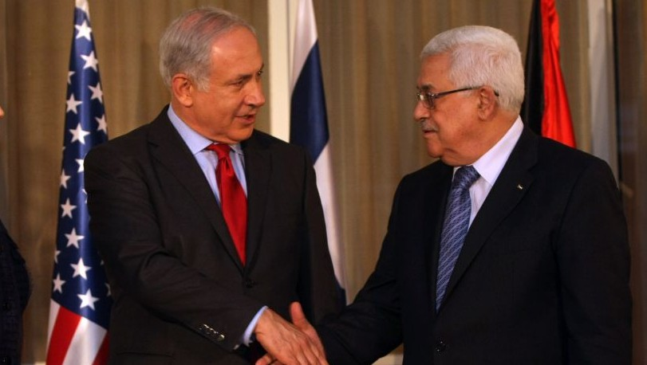
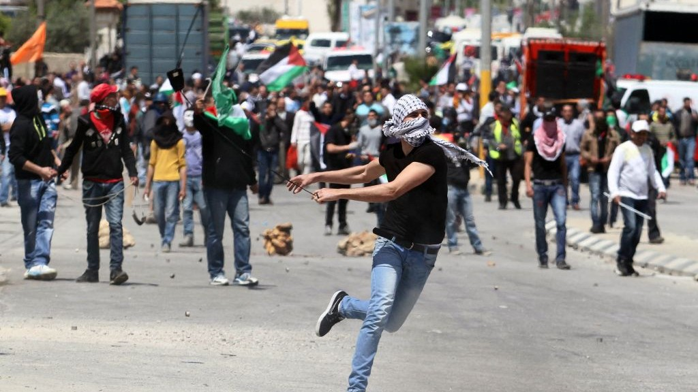

The conflict between Israel and the Palestinians rarely fade away from the news, and the last year has been no different. For decades, the international community has supported a two-state solution along the 1967 borders as the blueprint to solving the conflict between Israel and the Palestinian territories it occupies. However, the peace process between Israel and the Palestinians has stalled, and an agreement between the two parties seems further away than ever. Much has changed in the last number of years, and while the United Nations (UN) clings to the belief that the two-state solution is the only way to achieve peace, they may be forced to seek alternative solutions in the future.

In this piece, we’ll examine the history of the conflict and the peace process, its struggles and the bumps on the road that it has experienced. And while there may be consensus around the idea of a two-state solution, perhaps now is the time to reconsider that, and look at solutions that focus instead on granting independence to Jerusalem.

Prime Minister of Israel Benjamin Netanyahu and President of the Palestinian Authority Mahmoud Abbas.

##How did we get here?

After Israel defeated its Arab neighbours in the Six Day War of 1967, the country took control of the Palestinian territories, which had previously been occupied by Egypt and Jordan respectively. Since this decisive victory, Palestinian activists and militants have conducted multiple campaigns, both peaceful and violent, aimed at forcing an Israeli military withdrawal from the Palestinian territories.

Israel didn’t just face trouble from the Palestinians either. In addition to the Palestinian territories, Israel also took over the entire Sinai peninsula from Egypt in the Six Day War and immediately began constructing settlements. However, after the Yom Kippur War (or October War), Israel eventually handed over control of the Sinai back to Egypt in 1979. In addition, after decades of secret negotiations, Israel settled matters with Jordan in 1994, and reached a permanent peace agreement with them. Negotiations between Israel and its Arab neighbours have tended to be a slow and torturous process, and a resolution to the Palestinian conflict looks to be further away than ever before.

After Arab states rejected the UN partition plan of 1947, which would have divided the region into a Jewish state and Arab state, they immediately attacked the fledgling Jewish state. The result of the 1948 Arab-Israeli war was the founding of modern Israel, the occupation of Gaza by Egypt, and the occupation of the West Bank by Jordan. There is little doubt that the war left the Arab states in a worse off position than if they had accepted the UN plan in the first place.

This failed tactic of refusing compromises with Israel has been repeated several times since then. The latest rejection came in 2008, when Israeli Prime Minister Ehud Olmert proposed a two-state solution as part of a package that included land swaps in several areas to resolve the issue of Jewish settlements on the West Bank,widely viewed as illegal by the international community. Palestinian Authority President Mahmoud Abbas refused to approve this proposal, and since then, the Palestinian position has weakened further.

The major exception to this approach was when Israeli PM Yitzhak Rabin and PLO leader Yasser Arafat signed the Oslo Accords in 1993, establishing a Palestinian Authority, and granting the Palestinians limited autonomy in certain parts of the West Bank. It was supposed to be a starting point for further negotiation, but progress has stalled since then, and so much has changed that the possibility of a two-state solution becomes more and more remote every day.

Prime Minister Rabin was assassinated in 1995 by an extremist Israeli nationalist, which was in itself a big blow to the peace process. In addition, there have been two Palestinian uprisings (or intifadas), and a huge increase in the number of Israeli settlements in the West Bank. Stabbings and attacks on civilians are commonly perpetrated by Palestinian terrorists, and the Israeli occupiers have often responded with extreme force. One example of this is Israel’s policy of destroying the homes of terrorists’ families after the combatants themselves  had already been killed. Violence comes and goes regularly in Jerusalem and the West Bank, and with each Palestinian attack, Israel seems to tightens its grip on the territory.

Meanwhile in the Gaza Strip, Israel withdrew its troops and settlers in 2005, but this move was immediately followed by the the election of Hamas, an extremist Islamic organisation that has also been designated as a terrorist group by many countries. Since the rise of Hamas, there have been several clashes in the Gaza region. Hamas has launched thousands of crude rockets at Israel, and Israel has hit back with overwhelming, sometimes disproportionate force. The most recent example of this is the war between Hamas and Israel in 2014,which claimed the lives of over 2,000 Palestinians, and more than 70 Israelis. A ceasefire has been in place since 2014, but the prospect of a permanent peace agreement is remote, and Israel continues to impose a blockade on the Gaza Strip’s ports and airspace.

##What next for the peace process?

As of January 2018, the Palestinians’ diplomatic position seems weaker than ever before, and the Israeli government is more than happy in its current situation. Before describing the solution being put forward in this piece, we must first acknowledge that it would be the preferred choice of neither Israel nor the Palestinians. Instead, the international community needs to change its own views on the matter, and then get to the business of persuading the two sides to accept this solution. Under the current US administration, this is all but impossible. However, other states in the UN security council could champion this solution, win over the international community and force the US’ hand.

Towards the end of 2017, President Donald Trump announced that the US would recognise Jerusalem as the capital of Israel, and would take steps to move its embassy there from Tel Aviv. This announcement was met with outcry on the international stage, and Palestinians engaged in violent protest against this announcement. Nonetheless, Israel’s position has been strengthened ever further by this announcement, and the current government of Israel has taken steps to make it more difficult to reach an agreement with the Palestinians. Members of the ruling Likud party have called for the annexation of Jewish settlements constructed in the West Bank, and the Knesset (or parliament) has just passed a bill that would increase the threshold required to be met before Jerusalem is handed over to “a foreign party”.

On the other side, leaders of Muslim-majority countries have called on the UN to recognise the eastern part of Jerusalem as the capital of Palestine, and Iran’s parliament has passed a bill calling for the whole of Jerusalem to be the Palestinian capital. The US has shown that it favours Israel in almost all issues, which undermines its at being a neutral party in negotiations. If not for the US making use of its veto, the UN would have passed countless resolutions and sanctions against Israel for its conduct towards the Palestinians. Even without US intervention, the international community has made little progress in making its wishes for a two-state solution a reality. This call by leaders of Muslim majority countries could serve as a catalyst for a change in policy, but only if implemented correctly. Rather than calling for the division of Jerusalem between two separate states, they should instead advocate for Jerusalem to be an independent city-state, with a strong separation of church/synagogue/mosque and state.

Palestinian rioters.

##The city-state of Jerusalem

So, what might an independent Jerusalem look like? To start, the entirety of the city, along with the surrounding countryside, would fall within the city-state’s borders. Israeli forces would withdraw from the city and a new, democratically elected government would be formed. All inhabitants, whether Jewish, Muslim or Christian, would gain full citizenship. In addition, Palestinians who fled from the advancing Israeli forces in the Six Day War would be granted the right of return wherever possible. The discriminatory practice of pressuring non-Jews to sell their property would be abolished, and each major religious or ethnic group would be allowed to buy and sell their properties freely without fear of discrimination or intimidation.

The elections will inevitably split Jerusalem’s inhabitants along religious and ethnic lines, so a typical representative democracy would not be feasible in an independent Jerusalem. Instead, a new constitution would be needed - a constitution that would ensure that all major groups would be given some form of representation in the legislature, thereby allowing for each group to have a say in how Jerusalem is run. The executive would be rotated among each group (for example, Jews, Muslims, Christians and Armenians) and granted few powers. This would foster a spirit of government based on negotiation and compromise, rather than each group seeking to impose their will on others. Similar approaches have been followed by Belgium, Northern Ireland, and nearby Lebanon. Each country still faces its own challenges, but lessons can be learned from their approaches to reaching a lasting peace in their respective regions.

An independent Jerusalem would have free movement and trade with its neighbours Israel and an independent Palestine. Palestinians and Israelis alike would have more rights in Jerusalem than other foreigners, but those rights would still be limited. The issue of religious sites like the Temple Mount and the Dome of the Rock would need to be settled between the three parties before a final agreement is made. Both Israel and the Palestinians have called for Jerusalem to be their capital, or at least divide the city into east and west. Under this plan, the two parties would have to change their capital to Tel Aviv in Israel, and Ramallah (currently the administrative centre of the Palestinian Authority) in an independent Palestine.

The idea of an independent Jerusalem may be considered by many to be radical, but it has some precedence. In 1947, the UN drew up plans to partition UK-held Mandatory Palestine, the region that has since become Israel and the Palestinian territories. This plan aimed to give one state to the Jews, one to the Arabs, and a special status to was to be granted to Jerusalem. This would have, in effect, put Jerusalem under the control of the UN. However, the one major difference between the 1947 partition plan and this one would be the that Jerusalem would be run by people from within its own borders, rather than by some international agency based thousands of miles away.

##Time for an end to the occupation and division of Jerusalem

Jerusalem has changed hands multiple times throughout its history.  It was first established by pagans, and has since been held by the ancient Jewish kingdoms, the Romans, successive Muslim empires and the Crusaders, among others. It’s well past time that the people of Jerusalem stopped being occupied by foreign powers, and instead took hold of their own destinies. Neither Israel nor Palestinian nationalists would be particularly enthusiastic about this solution, so international cooperation would need to make every effort to persuade the two parties that this solution is the right one. Under the current US administration, this challenge would be all but impossible as the US would likely veto any resolution against Israel. However, future presidents could take the lead on this idea and present it as a removal of one of the major stumbling blocks toward peace between Israel and the Palestinians.

Implementing this idea won’t be easy. In the event that this plan is taken seriously, a number of stumbling blocks would still remain. Israel still opposes the Palestinians’ claim of the right of return. The matter of holy sites in Jerusalem would have to be resolved, and the status of Jewish settlers in the West Bank would still need to be addressed. Nevertheless, with the cooperation of Jerusalemites and the international community, this plan could work to the benefit of all. Religious zealots and hardcore nationalists will never be pleased, but with the right conditions, an independent Jerusalem could become a great city once more, and return to peace. Only by running its own affairs can Jerusalem hope to escape the trend of occupation by successive empires and nations, and by dropping their claims for Jerusalem as their capital, Israel and the Palestinians can continue to make progress towards a lasting peace.