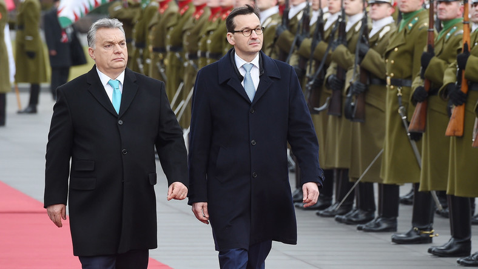
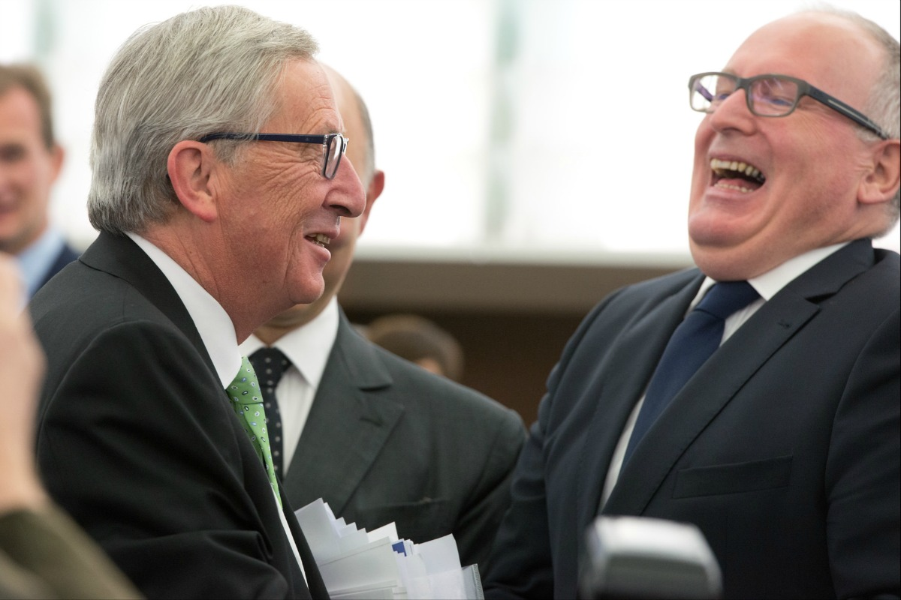

In October 2015, Poland elected a new government to be led by the right-wing Law and Justice Party. This election was seen by many as a negative response to German Chancellor Angela Merkel’s announcement the previous month to open Germany’s door to hundreds of thousands of asylum seekers, predominantly Muslims. Since this election, Poland has refused to take in 7,000 migrants as mandated by the European Commission and has passed sweeping laws to reform its judiciary, ostensibly with the aim of sidelining officials from the country’s communist era and improving efficiency. However, by granting the president and parliament the power to appoint and fire judges, the ruling Law and Justice Party has eroded the independence of the judiciary and has, in essence, grabbed power for itself. This has been met with huge concern by the EU, whose leaders are have begun taking steps to address this matter.

Poland has not been alone in its recent rows with the EU. Hungarian Prime Minister Viktor Orbán has been one of the most outspoken critics of the EU’s handling of the migrant crisis, and  has rode a wave of nationalist sentiment to solidify his position as the head of government in Hungary. Alongside Slovakia, Hungary registered a complaint to the European Court of Justice over the EU’s migrant resettlement scheme that set a minimum number of migrants the member states were required to resettle. This complaint was rejected in September 2017, much to Orbán’s dismay, and he pledged to continue fighting the EU’s migration policy.

##Tension Between the EU and former Eastern Bloc states

The tension between the EU and former Eastern Bloc states appears to be two-fold. First, it has been impossible for these states to ignore the high level of terrorism in countries like the UK and France, which have a relatively high percentage of Muslim inhabitants (roughly 5% and 8% respectively) and more recently Germany. In the months and years after the announcement of Chancellor Merkel’s open door policy, Europe suffered some of its worst terrorist attacks, including the Paris bombings and shootings of November 2015, the Nice truck attack in July 2016, and the successive terrorist attacks in the UK in 2017. While these attacks cannot be solely attributed to Merkel’s open door policy, it has nevertheless been easy for right-wing politicians to connect the dots, especially in Orbán’s case. In February 2018, Orbán claimed that his country was the last bastion against the “Islamisation” of Europe, and that “in the big cities of Europe there will be a Muslim majority” if immigration from Muslim-majority countries continue.

Viktor Orbán, Prime Minister of Hungary, and Mateusz Morawiecki, Prime Minister of Poland.

Second, and perhaps more important, the right-wing governments of Poland and Hungary seek to tighten their grip on power, and have become increasingly authoritarian. As previously discussed in Poland’s case, this has been done by eroding the independence of the judiciary, and granting the president and legislature the power to appoint and fire judges. With regards to Hungary, Prime Minister Orbán pushed through a raft of measures in 2013 that were aimed at restricting the freedom of the press, as well as reducing the level of checks and balances in Hungary’s political system. This has concentrated power into the hands of his party, Fidesz, which has ruled Hungary since 2010.

The upcoming election in April is shaping up to result another victory for Orbán’s Fidesz party, as polling indicates a favourability rate of about 50%, far higher than the next highest party at around 16%. However, an unexpected defeat in a February by-election has cast some doubt into the future of Orbán’s rule, and he may attempt to take measures to solidify his position even further.

##Potential measures to address the current challenges

The power grabs by Orbán and the Polish government have caused grave concern within the EU, as the rule of law in these countries have regressed to the days before their accession to the EU. By taking the EU mandated steps to strengthen the rule of law and the system of checks and balances, only to weaken them after accession, Hungary and Poland have forced the EU to consider drastic measures to preserve the rule of law.

One such measure being pursued in Poland’s case is to strip the country of its voting rights under Article 7 of the Treaty on European Union. The EU has already taken steps to implement this measure, known as the “nuclear option”, and has gained the support of the European Parliament. However, it is unlikely to be implemented in the near future as it requires a unanimous vote from the member states and Orbán has pledged to vote against such a measure if it came to a vote.

In a recent development, the High Court of Ireland has refused to extradite a Polish national, claiming that the rule of law had been undermined by the “immense” legislative changes since 2015. The case has been referred to the European Court of Justice, which may open a second front in the stand-off between Warsaw and Brussels over the Polish government’s judicial reforms. In the event of an ECJ ruling against Poland’s judicial reforms, the government would be left with a choice to either implement the ruling, or risk financial penalties, again to be determined by the ECJ.

A third solution could see the EU withhold vital funding to Poland with the promise of continuing funding upon the repeal of the judicial reforms. This measure has been endorsed by French President Emmanuel Macron as a way to effectively combat efforts by Poland to undermine the rule of law. Such a measure would doubtless be contentious if considered, and cries of extortion would ring from right-wing circles. However, if implemented, it would show Poland and other member states that the rule of law is sacrosanct in the EU, and attempts to undermine it will be met with fierce resistance.

Jean-Claude Juncker, President of the European Commission, and Frans Timmermans, First Vice-President of the European Commission.

The prospect of any of these scenarios becoming reality is doubtful for different reasons, yet that has not stopped populist rhetoric from entering the debate, as warned by Polish Prime Minister Mateusz Morawiecki. Indeed, Polish President Andrzej Duda has compared the country’s membership of the EU to past military occupations imposed by foreign powers like Russia, Prussia and Austria before the country’s independence in 1918.

None of the solutions discussed here are ideal, and all have the potential to increase resentment and fear among member states if implemented. The EU’s determination to preserve the rule of law within its member states must be tempered by the reality that several European governments have become increasingly authoritarian in recent years, and are eager to to tighten their grip on power. While Poland, Hungary and other former Eastern Bloc states are huge beneficiaries of EU funding, their governments also wish to rule their countries as they see fit. Withdrawal of these countries from the EU would be a huge blow to the union, and potentially result in its disintegration.

In order to counteract the potential negative effects of punitive measures, the EU could perhaps also take steps to reassure its former Eastern Bloc member states that the days of subjugation under the Soviet Union will not return. The trend since the EU’s formation in 1957 as the European Economic Community has always been that of closer integration between the member states. In 1983, the then 10 heads of state and government of the member states signed the “Solemn Declaration on the European Union”, which called for “ever closer union” between the member states. This was done before the collapse of the Soviet Union and Eastern Bloc, and future EU member states have had no opportunity to debate the merits of this declaration. Concrete measures to implement this declaration have included successive treaties such as the Treaty of Maastricht in 1992 and the Treaty of Lisbon in 2007.

In addition, leading European politicians have called for the EU to be transformed into a federal state, similar to that of the US. These figures include former President of the European Parliament Martin Schulz and former Prime Minister of Italy Matteo Renzi. Such calls for further integration reflect the wishes of the citizens of several member states, but the governments of former Eastern Bloc states are among those who oppose such an idea. A pledge from the EU to drop its push for further integration could serve as an olive branch to Poland and Hungary.

The EU leadership must weigh its options carefully. With rival states like Russia and China becoming increasingly belligerent, the US’ status as a superpower in decline, as well as the potential for the EU to be a major international player, the need for the EU to keep its member states happy is imperative to its future success and survival.

