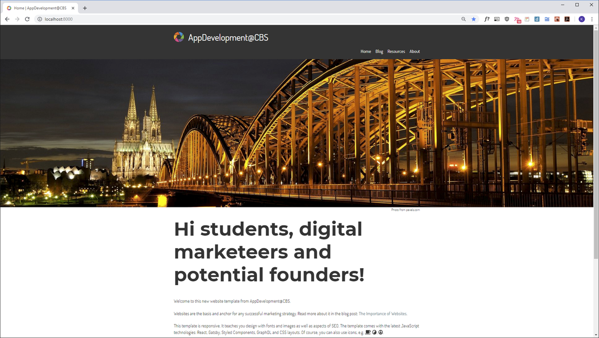

In a market that becomes increasingly more competitive it is an absolute necessity for every company, to present itself and its products.
Without current, state-of-the-art, attractive, detailed and constantly updated information it is difficult for companies to convince customers or intermediaries of the benefit of its products.

This is even more true for startups. Because of their scarcity in funding they normally have to rely on digital marketing strategies alone in order to market their new product or innovation. Anchor and basis of all marketing strategies is the website. It forces startups to clearly formulate the unique selling proposition (USP) of their product and to present the product in the most attractive way.

The enormous importance of websites for companies — and especially for startups — however has the following consequence: a website must constantly be updated, adapted or improved and should also give the customers information about current developments.

It is not for nothing that many companies maintain a blog in which potential or existing customers are informed about recent developments in the company or product. Because in the digital world is nothing as harmful as a website that is outdated or that insufficiently informs the customer. Agile, time- and market-related changes can usually only be properly reflected if the website is developed and modified under the company's own direction. Too long, too time-consuming — and often too expensive for startups — is the access to the internet only with the help of a marketing agency.

For this reason CBS offers at present interested students an elective lecture in which students can use the technologies of the Internet and learn how to program their own — even complex — international websites. The programming takes place in JavaScript — the language of the browser. The most modern and currently most successful libraries are used for programming. These libraries enable component-based and reusable development. In addition to the the programming, of course, all relevant issues of website design are used: responsive design that changes depending on the medium (smartphone, tablet, desktop), design with fonts and images, implementation of a blog, etc. Similarly, also a connection is made to digital marketing by reflecting aspects of SEO (Search Engine Optimization). Finally the template also addresses the issue of data-protection.
