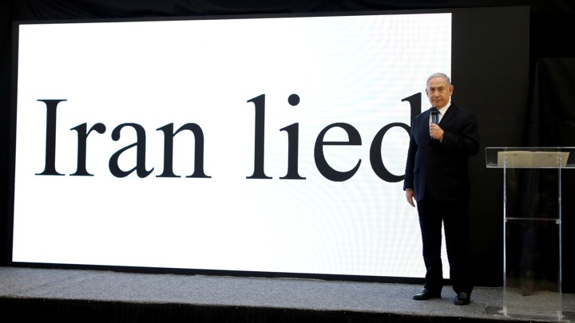
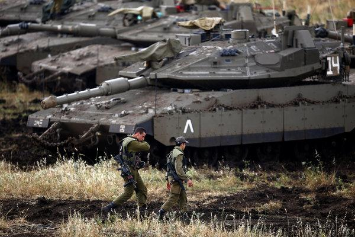
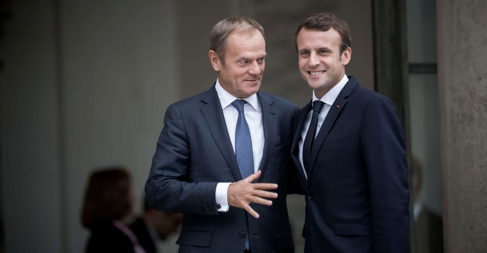

On the 30th of April, Israeli Prime Minister Benjamin Netanyahu gave a presentation in which he claimed that Iran lied “big time” about its nuclear weapons programme and its attempts to hide tens of thousands of secret documents about the programme, discovered by Israeli intelligence agents. This presentation was met with widespread criticism, with officials from France, Germany and the UK indicating that this was not new information, and that it was the reason for the existence of the nuclear deal with Iran (called the Joint Comprehensive Plan of Action) in the first place.

Criticism has also come from weapons experts, who have claimed that Iran’s nuclear weapons programme has not been a secret since 2003, and that Iran has not taken steps to restart it since the nuclear deal was reached in 2015. This is concurred with by experts in the International Atomic Energy Agency, who have added that Iran has been fully compliant with the terms of the nuclear deal since inspections began.

Israeli Prime Minister Benjamin Netanyahu gives a presentation claiming new evidence of Iran's dishonesty regarding its nuclear programme.

Nevertheless, Netanyahu’s presentation impressed US President Donald Trump, who, the following week, withdrew the US from the agreement with Iran to restrict its nuclear ambitions. During a press conference with Nigerian President Muhammadu Buhari, Trump praised himself for his past scepticism of the deal, proclaiming that he was “100 percent right” about Iran’s supposed dishonesty. US Secretary of State Mike Pompeo claimed that the presentation showed that “Iran hid a vast atomic archive from the world and from the IAEA, until today”; an inaccurate statement, as the IAEA had already documented this archive previously. With the US now withdrawing from the agreement, world tension looks likely to increase, and the Trump administration’s foreign policy risks precipitating further decline in US influence on the world stage.

In this blog, we will briefly examine the events leading up to the formation of the Iran nuclear deal, as well as some of the consequences that may arise due to US withdrawal from the deal. We will focus primarily on the potential pitfalls for the US and Israel, who have been the most outspoken critics of the deal.

##Iranian nuclear ambitions pre-agreement

Having successfully orchestrated a coup against Iran’s democratically elected government in 1953, the US aimed to build relations with the restored monarchy with a view to positioning it against the Soviet Union. In the mid-1950s, the US helped the then friendly Iranian monarchy to launch and develop its nuclear programme. After the Islamic revolution in 1979, Iran opted to form an independent nuclear policy, and in the 1990s, reached an agreement with Russia, in which Iran would receive Russian assistance in the form of nuclear experts and technical information. In the early 2000s, evidence emerged of Iran’s clandestine uranium enrichment programme, resulting in huge alarm among various actors, especially the US. in 2006, the UN security council demanded that Iran suspend its secret nuclear programme, asserting that it was in violation of the Non-Proliferation Treaty that the monarchy had signed in 1970. Nevertheless, Russia continued to assist Iran in its nuclear ambitions and in 2011, Iran opened its first nuclear power plant.

Opening the power plant came at an enormous cost to Iran. Having been subject to one of the largest economic sanctions programmes for over a decade, Iran lost up to $100bn in oil revenue and up to $500bn in lost potential opportunities. Under increasing angst and unrest at home, the Iranian government negotiated an agreement with the permanent members of the UN security council, non-permanent member Germany, and the European Union which would allow Iran to continue enriching uranium for civilian energy purposes, while cutting its stockpile of already-enriched uranium by 98%. This would dramatically decrease Iran’s nuclear capabilities, while still allowing for the country to pursue nuclear as a civilian energy source, as they have claimed as their goal for years.

The deal was not ratified in the US Congress, yet up until this week, Iran has received relief from sanctions as part of the deal. New business relationships have been formed, and the country has received increased foreign investment since 2015. All of this progress has been put at risk due to the US’ withdrawal from the deal, but the sympathy of many countries across appears to be with Iran, rather than the US, with the obvious exception of Israel, led by right-winger Benjamin Netanyahu. Indeed, the US and Israel appear to be alone in their disdain and mistrust of Iran, risking an increasing level of diplomatic isolation on the world stage.

##Israel

Israeli Prime Minister Benjamin Netanyahu has long warned of Iran’s aims to acquire a nuclear weapon, with his first claim of Iran’s impending ownership of nuclear weapons being made in 1993. Since then, he has made several appearances in which he spoke out against Iran’s nuclear programme, including one in front of the United Nations Assembly, in which he presented those gathered with a cartoon drawing of a bomb, as well as the US Congress, in which he directly contradicted US President Barack Obama’s stance on the issue.

Mere hours after Trump’s announcement of the US’ withdrawal from the deal, Israel and Iran clashed in the Israeli-occupied Golan Heights, with Iran launching rockets against Israeli forces, and Israeli troops launching a raid into Syria resulting in the deaths of 15 people, including 8 Iranians. At the time of writing this blog, tensions between the country have arguably never been higher, and there is an increased possibility of all-out war between Israel and Iran. This escalation in tension is a direct consequence of the US’ withdrawal of the nuclear deal, with both Israel and Iran feeling emboldened to take stronger action against each other. Trump’s decision to withdraw the US from the deal has increased regional tension immeasurably, and hardliners within Iran may push for its leaders to abandon the agreement altogether and rush to acquire a nuclear weapon.

Israeli soldiers in the Golan Heights.

To abandon the agreement and rush to acquire a nuclear weapon would without doubt be a risky option for Iran’s leadership, as sanctions would no longer come from just the US, but all the other parties of the agreement. As a result of increased financial burdens from the sanctions, civil unrest within Iran could place further pressure on the country’s rulers. However, with pro-interventionist figures such as John Bolton and Mike Pompeo occupying important positions in Trump’s administration, as well as the US’ previous history of toppling regimes after agreements to dismantle nuclear weapons programmes, the Iranian regime may feel it has no choice but to acquire nuclear weapons to solidify its position and preserve its rule over the country. Israel would not tolerate this development and could conceivably attack existing Iranian nuclear facilities, which would be all but a declaration of war.

An additional option for Iran would be to increase its support for terrorist organisations including Hamas and Hezbollah, in addition to continuing its support for Syrian President Bashar al-Assad. With Israel being surrounded by hostile actors, the country would have to divert more of its resources into protecting its borders and military infrastructure, and the prospect of peace between Israel, Lebanon and the Palestinians would continue to be remote.

##United States

While the US has reneged on several treaties and agreements since the 20th century, the Trump administration’s quick abandonment of important foreign policy approaches, including the relocation of the US embassy from Tel Aviv to Jerusalem, withdrawal from the Paris Agreement and now the nuclear deal with Iran, has left the US angering its allies and increasing its level of isolation on the world stage. Already we have seen the US’ NATO ally Turkey holding several talks with Iran and Russia on the future of Syria in Kazakh capital Astana since 2017, notably excluding the US. This serves to highlight Russia’s increasingly important role in Syria and the wider Middle East at the expense of the US.

In response to increasing US unpredictability, European states may be forced to consider pursuing a more independent foreign policy. While the United Kingdom and France have attempted to bring the Trump administration more into line with their views on foreign policy, they have met with little success, with the notable exception of the three countries’ recent bombardment of Syrian military installations in the wake of a suspected chemical attacks on civilians in a rebel-held town. In the future, the UK and France, along with Germany may consider forming a united foreign policy independent of the aims of the US, both with regards to the Middle East as well as the threat from Putin-led Russia.

Relations between the US and the European Union have also become strained in recent months, due partly to Trump’s threats to impose tariffs on certain goods being imported from EU states. In addition, the EU played an important role in the formation of the Iran nuclear deal, and EU diplomatic chief Federica Mogherini has stated that the EU is “determined to preserve” the deal. In a signal of its intent to preserve the deal, the EU has now prepared counter-measures to mitigate the effects of new US sanctions on Iran. Such measures include “blocking regulations” which were used in 1996 to counter the effects of US sanctions on third countries doing business with Libya, as well as a longer-term strategy among European states to form an economic policy that is more independent of the US.

In the last number of years, the EU has not stood idly by while worrying about the US’ unstable foreign policy practices. After years of negotiation, 25 of the 28 EU member states reached an agreement in September 2017 to form closer ties between their militaries, named the Permanent Structured Cooperation (or PESCO). This agreement aims to harmonise the members’ efforts at defence research, equipment acquisition and utilisation, as well as deeper cooperation at the tactical level. In a strong signal of intent, the EU published plans in March 2018 to implement a “military Schengen zone”, with the aim of increasing the speed of mobilisation among European militaries in case of confrontation with hostile actors. While NATO remains the most important alliance between European states and the US, the EU has taken concrete steps to develop and pursue its own foreign policy in many aspects, including diplomacy, economics and military. The actions of the Trump administration alone cannot be blamed for this shift in policy, but it certainly has given proponents of greater European independence an easier case to make.

President of the European Council Donald Tusk and President of France Emmanuel Macron.

Another likely consequence of the US’ withdrawal from the nuclear deal is the rising presence of Russia in Middle Eastern geopolitics. As a key ally of Iran and the Assad regime in Syria, Russia has played an increasingly important role in the events of the region. Halting the advance of anti-Assad rebels in Syria, as well as solidifying Assad’s position of power, Russia now has the presence in the Middle East to ease tensions between Iran and Israel. Iran and Israel are on opposite sides even in the Syrian civil war, with Iran supporting Assad with troops and weapons, and Israel lending medical support to rebels and regularly bombarding regime forces. With the US increasingly disengaging from its role in the Middle East, Russia can now hold the role of power broker in the region. Amid the clashes between Iranian and Israeli forces in the Golan Heights and Syria, Israeli Prime Minister Benjamin Netanyahu spent the entire day on Wednesday 9th of May explaining Israel’s policy in Syria in detail to Russian President Vladimir Putin. Putin’s subsequent decision to withdraw offers to sell Russian anti-aircraft weapons to the Assad regime highlights this increasingly important role that Russia has played in recent years, thanks in part to the increasing disengagement of the US in the region.

What the long-term effects of Trump’s decision to withdraw the US from the Iran nuclear deal will be is anybody’s guess, but an increasing Russian presence in the Middle East, growing distrust between the US and its European allies, and a huge increase in tensions between Israel and Iran all point to the US’ declining influence on the world stage, in addition to an increasing level of hostility towards Israel. By withdrawing from one of the most important international agreements of the 21st century so far, Trump may one day rue the damage this may cause to the US’ most important foreign policy interests, including the protection of Israel, and the prevention of Iran from acquiring a nuclear weapon.

