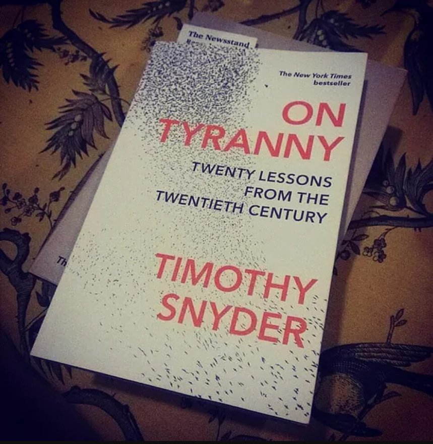

In the 20th century, a litany of liberal democracies in Europe fell to tyrannical forms of government like fascism, communism and nazism. After the bloodiest war in history saw the fall of fascism and nazism, the world saw decades of tension between the democratic United States and the communist Soviet Union. After the fall of communism in Europe, there was renewed hope of liberal democracies flourishing across the globe. However, this did not quite turn out to be the case. Nowadays, there are renewed concerns that tyranny is making a fresh assault on liberal democracies. In this book, released in March 2017, history professor Timothy Snyder aims to teach us a few lessons on how to prevent tyranny from taking over democracies once again (particularly the US). Read on to see if he succeeds in delivering his message of resistance against the creeping tyranny facing liberal democracies.

On Tyranny: Twenty Lessons from the Twentieth Century by Timothy Snyder

On Tyranny: Twenty Lessons from the Twentieth Century is 128 pages long and published by The Bodley Head. In this short book, Snyder aims to highlight lessons to be learned from history, so that we may protect our countries from the threat of tyranny. Snyder draws these lessons specifically from the 1920s to the 1940s, when successive European countries fell to the tyranny of fascism, nazism and communism, and gives the reader some helpful tips on how to prevent a similar fate befalling their country. By learning to think independently and critically, as well as being socially active, populations can take many steps to strengthen democracy.

Throughout the course of this book, many lessons tie in together to make a few important themes. Snyder’s central aims are for readers to learn to think independently and critically, and also for the readers to get involved in public life and the democratic process (whether running for office, taking part in marches or being active with non-governmental organisations). On the whole, the lessons hit their mark and could well be extraordinarily helpful should the worst-case scenario arise. However, during the course of reading this book,there were more than a few instances where I rolled my eyes, whether at Snyder’s use of hyperbolic language, his oversimplification of politics, or his childish refusal to refer to US President Trump by name.

##Critical thinking

Many lessons in this book combine together to make up a couple of crucial pieces of advice, the first of which is to think critically. This means refusing to obey in advance (or acting in a way you think would please a tyrant), being wary of shows of loyalty, and investigating important issues covered by credible news sources, among others. As well as this, Snyder highlights the importance of being social in real life settings, and not just social media. Whether it be in politics, work or a hobby, face-to-face interactions are a vital tool against the dehumanisation of others. Dehumanisation is a tactic that has pitted neighbours against each other, with tyrants being the ultimate winner.

Snyder claims that mainstream media is no longer mainstream, and that commentary against it is. As such, we should put more trust into credible news and especially print media. This would help subsidise investigative journalists and enable them to do their jobs properly, rather than falling for clickbait articles or fake news. There is truth to this, but the notion that mainstream media is now somehow “edgy” as a result of increasing backlash is almost laughable. There are countless examples of mainstream media ignoring real news stories in favour of manufacturing outrage. One such example is CNN’s obsessive coverage of President Trump’s tweet that erroneously included the word “covfefe”, which meant “coverage”. CNN spent countless hours of airtime covering this “scandal” when they could have spent more time covering stories like the resignation of Trump’s communication director, or the ongoing investigation into Trump’s campaign officials colluding with Russia to influence the election in 2016. There are plenty of good reason to distrust mainstream media and for Snyder to disregard it offhand is to fail to realise just how poor mainstream media has become in many ways.

Snyder argues that a useful way to keep one’s mind sharp is to read books, whether fiction or non-fiction. He’s even included an entire reading list, naming novels like The Brothers Karamazov by Fyodor Dostoevsky and even Harry Potter and the Half-Blood Prince by JK Rowling. Snyder also recommends books on politics and history like The Origins of Totalitarianism by Hannah Arendt and How to Be a Conservative-Liberal-Socialist by Vaclav Havel. By reading books like these, we can learn from history and gain inspiration from characters both non-fictional and fictional.

Another key lesson from this short book is to stand against power grabs in the face of terrorist attacks or tragedies. Snyder gives the example of the burning of the Reichstag in 1933, and how the Nazis used this opportunity to impose martial law on Germany. However, what Snyder fails to mention is that Americans themselves have fallen for this tactic in the recent past. After the terrorist attacks of 9/11, the federal government passed the insidiously named “Patriot Act”, granting it wide powers to snoop on US citizens without a warrant.  While further power grabs can be avoided, we must be careful not to put our own comfort and perceived security at the expense of real freedom.

##Being social

The second important theme of this book, as stated previously, is to be socially active in real life situations, whether in politics, charities, or hobbies. By putting oneself out there in the real world, the reader can avoid falling for the trap of dehumanising one’s neighbour, and directing their efforts towards more positive and constructive goals. This doesn’t necessarily have to be political. It can be for any number of good causes, like charity or activism.

According to Snyder, we can learn lessons from history, but also learn from more recent events in other countries. By making friends with people from abroad, we can learn in detail how populations can fall into tyranny, and how citizens in liberal democracies can avoid a similar fate. In fact, Snyder decries the small percentage of US citizens holding passports (about 10%) and attributes this to the notion that Americans would prefer to “die defending freedom in America.” However, this misses the simple fact that traveling abroad is cost-prohibitive to many Americans, and unfortunately, traveling abroad is often the reserve of wealthier earners.

##Conclusion

As I stated previously, there were a number of times where I felt Snyder oversimplified complex topics like the rise of Donald Trump and media coverage of the 2016 election campaign. This is partially as a result of the book’s short length, but also partially as a result of Snyder’s biases, particularly against Trump and Russia. In addition, this book is very “of its time”, and certain parts could well be out of date by the 2018 US congressional elections. Nevertheless, it’s easy to read, and Snyder largely succeeds in his aim to remind readers of how vulnerable democracies can easily be taken over by tyrants. If we are to defend democracy against tyranny, we must look first within ourselves before looking outwards. By strengthening our institutions and speaking out when needed, we can all play our part in keeping tyrannical forms of government from taking over liberal democracies again.
