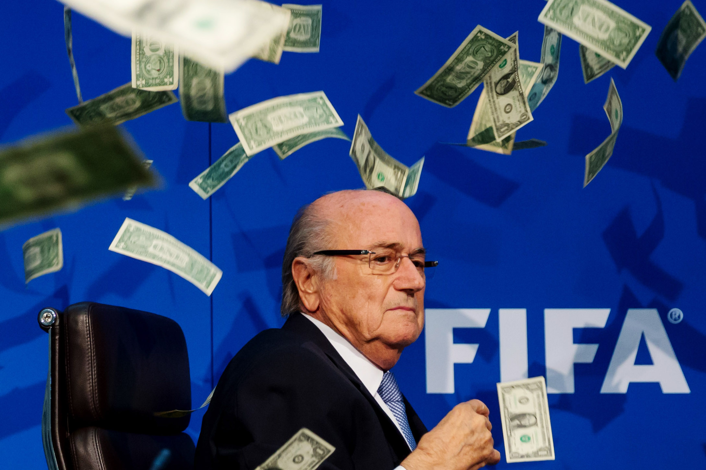
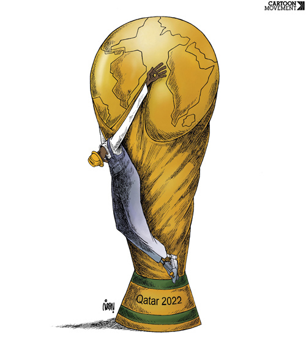

In December 2010, FIFA held a vote to decide where to hold the 2018 and 2022 FIFA World Cup tournaments. Russia won the 2018 bid and Qatar won the bid for 2022. Almost immediately, allegations of bribery and corruption surfaced, and the integrity of the World Cup vote has been brought into serious question. Since 2010, there have been endless corruption investigations, a complete overhaul of the FIFA leadership, as well as countless stories describing the plight of foreign construction workers building the stadiums and infrastructure in Qatar. In this blog, we’ll take a look at the scandals that have unfolded after Russia and Qatar were named World Cup hosts, the subsequent corruption investigations, and the horrifying treatment of workers in Qatar, which has resulted in over 1000 deaths.

##The vote to decide the hosts for the World Cup

After the success of the 2010 World Cup in South Africa, and after having already given Brazil the hosting rights for the 2014 tournament, the FIFA Executive Committee set about deciding which countries should host the next two World Cups. The candidates to host the 2018 World Cup were Russia and England, with joint bids being made by the Netherlands with Belgium, and Spain with Portugal. The candidates for the 2022 tournament were Australia, Japan, South Korea, the US, and Qatar. Russia made promise to scrap visa requirements for visitors and also promised free public transport for World Cup fans. Meanwhile, Qatar made the case that it would be the first Middle Eastern country to host the World Cup, that while the facilities to host such a large tournament were lacking, it would spare no expense in building first-class facilities and stadiums in the run-up to 2022. Questions arose over the respective countries’ suitability for hosting the World Cup, including Russia’s history of racism in football, as well as Qatar’s extremely hot summer climate. Nonetheless, Russia was given the hosting rights for the 2018 World Cup and Qatar for 2022.

Since the vote, there has been a storm of scandals involving corruption and further questions raising concerns about the respective countries’ suitability to host the World Cup. Even during the run-up to the vote, two voting members of the FIFA Executive were suspended over corruption, and the result of the vote was met with strong criticism, including from US president Barack Obama. Amid numerous claims of bribery and corruption, several investigations into corruption were launched by FIFA, as well as Switzerland and the US.

##Corruption, investigations, and change of leadership at FIFA

FIFA’s internal investigation report cleared Russia and Qatar of blame regarding their conduct during their World Cup bids. Instead, the report singled out England for criticism, claiming it had flouted bidding rules. Almost immediately after the report was published, it came under fierce criticism. Chief among those critics was FIFA ethics investigator Michael Garcia, who claimed that the report, a 42 page summary of his full 430 page document, was “materially incomplete”, and contained “erroneous representations of the facts and conclusions”. FIFA refused to release the full document and Garcia resigned from his post, citing a “lack of leadership” at FIFA, as well as its decision to cover up his full report.

The pressure on FIFA only increased in the aftermath of this debacle. Less than six months after FIFA published its report, US and Swiss investigators conducted an operation in Zurich that led to the arrest of over a dozen high-ranking FIFA officials, most of whom were later charged with corruption. Further arrests have been made, with 40 officials being charged in US courts as of November 2017. The full extent of FIFA’s corruption is yet to be revealed, and investigations are continuing as of the time of writing this blog.

Just a few weeks after the US-led sting in Zurich, FIFA President Sepp Blatter resigned, despite having only been re-elected for another term the previous week. He was later banned from all football related activities for six years. Gianni Infantino was elected to replace Blatter, but has stubbornly refused to hold another vote on the 2022 World Cup. This is despite not only the horrendous working conditions in Qatar, but also the recent diplomatic offensive against Qatar by Saudi Arabia and other Arab Gulf countries. The case against holding the World Cup in Qatar continues to grow though, and there is still time for FIFA to change the host. Before getting into this, it’s first important to examine exactly why the decision to give the hosting rights to Qatar is such a poor one.

Former FIFA President, Sepp Blatter.

##The case against holding the World Cup in Qatar

First, the climate is simply too hot for the World Cup, reaching up to 50 degrees in the summer months. To combat this, Qatar has made an effort to build air-conditioned stadiums, and has completed its first one this year. Nevertheless, FIFA decided to hold the World Cup for the first time in November and December in order to avoid health issues for fans and players alike. This has caused enormous headaches for national football associations around the world, as this schedule would interfere with many domestic leagues, and force a long break in November and December. England’s FA Chairman, Greg Dyke, warned that the disruption to domestic leagues would be “considerable”. Nevertheless, such disruptions were seen as acceptable in order to protect the health of the players and fans.

Qatar has a host of other problems though, not least of which is its human rights record. The country is ruled by a royal family and imposes strict Shariah law on inhabitants and visitors alike. A great deal of freedoms taken for granted in liberal democracies are banned, and often punishable by death. Examples include consumption of alcohol, homosexuality, leaving the Islamic faith, and proselytism (the act of attempting to convert someone to another religion). Corporal punishment is often administered to people who break such laws. Flogging has been administered to those who commit adultery, and stoning is a legal form of punishment. Put simply, Qatar’s human rights record is nothing short of abysmal.

When asked about concerns facing gay fans in Qatar, former FIFA president Sepp Blatter attempted to laugh off the question, stating “I would say they should refrain from any sexual activities.” He then claimed that “We are definitely living in a world of freedom and I'm sure when the World Cup will be in Qatar in 2022, there will be no problems.” Suffice to say that Qatar’s human rights record was not a consideration for the FIFA executive when they decided to hold the World Cup there.

Former US footballer Robbie Rogers, who is gay, commented on the issue with Qatar’s stance on homosexuality: “If you look at the next few World Cups they are in places where, if I were to go, I would possibly be imprisoned or beat up. It is pretty ridiculous.There is going to be a number of gay fans that will go to watch the sport. There is going to be another gay footballer. It is an issue that needs to be spoken about and discussed with FIFA because every player should feel safe when they go to a World Cup.”

Perhaps Qatar’s most disgusting crime since 2010 is its treatment of the foreign construction workers building the stadiums and infrastructure for the World Cup. In September 2013, The Guardian revealed that dozens of Nepalese foreign workers died over the course of just a few weeks while working on construction sites in Qatar. Their passports had been confiscated and they were not given any ID. This, in effect, turned them into illegal aliens. Qatar promised to improve working conditions but one year later, The Guardian reported that conditions hadn’t improved, and that Nepalese workers were dying at a rate of one every two days. When taking into account the deaths of Indian, Bangladeshi and Sri Lankan workers, the death rate of workers could climb up to one per day across all nationalities. The International Trade Union Confederation estimated in 2013 that up to 4000 workers could die before a ball is kicked in the 2022 World Cup if working conditions aren’t improved, and it doesn’t look like they have as we approach the end of 2017.

Workers' Rights when Qatar hosts World Cup 2022. 

##What will it take for FIFA to change the venue for World Cup 2022?

As of the time this blog is being written, Qatar is under intense diplomatic pressure by Saudi Arabia and its allies, supposedly for its friendly relationship with Saudi Arabia’s rival, Iran. The details of this diplomatic blockade is beyond the scope of this blog, but one of its effects is that the political situation is more volatile in Qatar than at any point in its recent history, and FIFA has been forced again to pay close attention to developments in the Gulf region. In addition, a report has claimed that as a consequence for its political instability, Qatar could be stripped of its hosting rights, and that it would be given to one of the candidates to host the following World Cup in 2026 (Canada, USA or Mexico). Such a move has precedence. In 1974, Colombia was given the hosting rights for the World Cup to be held in 1986. However, financial concerns led Colombia to announce that it could not hold the event, and in 1983, Mexico was chosen to host the tournament instead.

That Qatar could be stripped of its hosting rights over outside political issues, rather than the fact that it is clearly unsuitable to hold arguably the world’s largest sporting tournament, is a disgrace. Qatar is a country with a native population of less than 320,000, has no footballing pedigree, and no interest in human rights. Its government enforces strict Shariah law on its inhabitants, and has treated its construction workers like slaves, comparable to the slave labour used by ancient Egypt to build the pyramids of Giza 5000 years ago. Nevertheless, if a political boycott led by fellow Wahhabist state Saudi Arabia is what it takes to move the World Cup to a more suitable location, then so be it.

However, this outcome is far from guaranteed. Even after the countless corruption investigations and great political turmoil, Qatari officials and the FIFA leadership continue to cling desperately to the belief that Qatar will still host the World Cup in 2022. If, despite everything, the decision is made to keep the World Cup in Qatar for 2022, the world must show FIFA that it will not stand for such an outrage. In order to send a message to FIFA, each and every country that plays football must boycott the World Cup and withdraw from the qualification campaign. Players should lead a campaign to raise awareness and show the world just how unsuitable it is for Qatar to hold the World Cup. If players like Neymar and Lionel Messi expressed their concerns, the  pressure on FIFA to act would increase ever further, and potentially tip the balance in favour of common sense.

Finally, football fans worldwide should pledge not to go the World Cup in Qatar. By sheer numbers, football fans have the power to make the World Cup the most expensive failure in FIFA and Qatar’s history. It would show the monarchs and the executives that the sport of football cannot be bought with money and power. It would be a huge blow to our collective humanity if, after all the suffering we have seen of foreign workers at the hands of a corrupt monarchy, football fans turned out in force for the World Cup in 2022. It would be the ultimate victory for billionaire aristocrats, and show just how little human beings care for each other. It would be yet another dark stain in the history of mankind.
