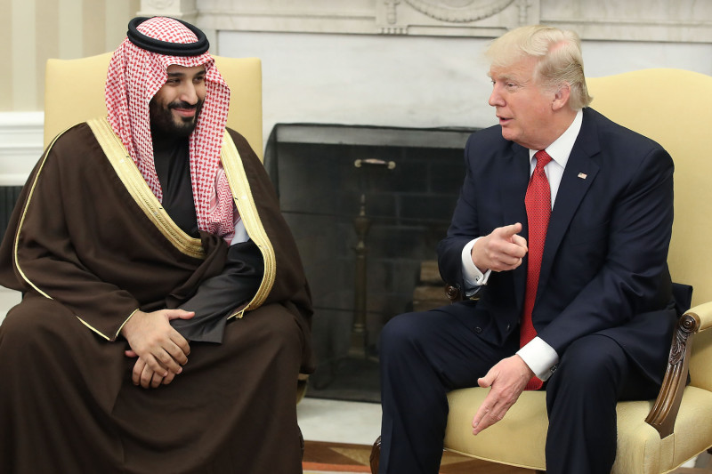

Since 2015, Yemen has been engulfed in a civil war that has claimed the lives of thousands of people, displaced millions more, and has brought starvation and disease to much of the population. The chief culprit for most of this suffering is not the Houthi rebels who overthrew the government led by Abdrabbuh Mansur Hadi,or the government forces themselves, but the Saudi Arabia-led intervention, aimed at restoring Hadi to power. Saudi Arabia’s intervention has consisted largely of airstrikes aimed at civilians and is responsible for a large percentage of civilian casualties. Saudi Arabia’s ability to wage war against the Houthi rebels has been enabled by countries like the United Kingdom, Germany, the United States and Canada selling them huge quantities of weapons and ammunition. In this piece, we’ll examine the controversy surrounding western arms sales to Saudi Arabia, the reasons behind them, and the conditions that need to be met before wester arms sales to Saudi Arabia can be halted.

##The war in Yemen and western involvement

In 2011, an uprising took place in Yemen that transferred power from then president Ali Abdullah Saleh to now internationally recognised president Abdrabbuh Mansur Hadi. Instability followed over the next few years, with corruption and unemployment being rife in the country, as well as Al Qaeda taking control of large chunks of territory in the north. Eventually, the Houthi rebel movement, led mostly by Yemen’s Shia minority, entered the capital, Sanaa, in late 2014 and took full control in early 2015. President Hadi fled the country in March 2015 and since then, the conflict has devolved into the standard “Shia vs Sunni” fight that has been a staple of Middle Eastern history for the last 1500 years.

Sunni states, led by Saudi Arabia, have intervened to restore Hadi to power, while Iran, a Shiite theocracy, has provided support and funding to the Houthis. Saudi Arabia has been the most active foreign actor in the war, conducting endless air strikes that have killed thousands, and leading a blockade in the country, resulting in millions teetering on the brink of starvation. Saudi Arabia’s role in the war has been sharply condemned in the international community, with the UN, Human Rights Watch, and Amnesty International all accusing the Wahhabist kingdom of committing war crimes in Yemen. Nevertheless, Saudi Arabia enjoys the support of its Sunni neighbours, including the United Arab Emirates and Egypt, as well as support from western governments. This support from western governments comes in the form of logistical support, but more importantly, the sale of vast amounts of weaponry to Saudi Arabia.

In the last year, the United Kingdom’s sale of arms to Saudi Arabia has skyrocketed from £280m between January and March 2017, to £836m between April and June 2017. This makes up £1.1b in arms sales in the first half of 2017 alone. Germany more than tripled its arms sales to Saudi Arabia from €41 million in the third quarter of 2016, to nearly €150 million in the third quarter of 2017. In Canada, Justin Trudeau’s Liberal Party government passed an arms deal worth $15 billion, though this is currently under review. Finally, US president Donald Trump signed an arms deal with Saudi Arabia that is worth up to $350 billion worth of arms sales over ten years. $110bn has supposedly been made available immediately, though this figure is disputed.

US President Donald Trump with Mohammed bin Salman, Crown Prince of Saudi Arabia.

##Controversy surrounding arms sales to Saudi Arabia

Each announcement of arms sales to Saudi Arabia has been met with near universal condemnation. The UK in particular was the focus of much concern by NGOs, and the case against the government was even taken to the High Court, with the complainant claiming that the arms sales were unlawful. The court ruled that the sales were lawful but nonetheless, several British MPs continue to raise concerns at the UK’s role in the large number of civilians being killed in Yemen. The High Court decision was appealed and the case against the government selling arms to Saudi Arabia is still ongoing.

Germany has previously halted arms sales to Saudi Arabia, though moreso for reasons of “instability”, rather than human rights concerns. Now, Saudi Arabia is the largest client of the German arms industry, and while concerns continue to be raised by the opposition Left Party, those sales seem set to continue for some time yet. In Canada, arms sales to Saudi Arabia are currently being reviewed over human rights abuses. However, the concern has been raised primarily on Saudi Arabia’s recent crackdown on protests in home soil, rather than their conduct in Yemen. After reports of using Canadian equipment to crack down on peaceful protesters in a town inhabited by Saudi’s Shia minority, the Canadian government has faced repeated calls to review its policy of selling weapons to autocratic nations like Saudi Arabia.

Like the UK, the Canadian government was challenged in court over the sales of weapons to Saudi Arabia last year. The court found in favour of the government, despite the government’s admission that Canadian weapons have been used against civilians in Yemen. However, renewed concerns over Saudi Arabia’s use of weapons against civilians in their own country has shone the spotlight once again on the Canadian government. Investigations are ongoing and human rights organisations are considering a fresh challenge in the courts.

The US is the single greatest contributor to Saudi Arabia’s campaign in Yemen. It has lent vital logistical support, as well as the sale of billions of dollars worth of weapons. Despite the recent agreement that promised up to $350bn dollars worth of arms sales with Saudi, there has been relatively little controversy within the US. Instead, much of the criticism and condemnation has come from abroad, with even Israel expressing concern that the deal may “blunt Israel’s military edge”.

##Why such strong support for Saudi Arabia?

Protection of Israel is the hallmark of western policy in the Middle East. Iran seeks to destroy Israel and is a major adversary of western governments. It is an Islamic theocracy that routinely conducts human rights abuses on its citizens and seeks to gain power and influence across the Middle East. Saudi Arabia is far from innocent though, and has an even more extremist Islamic form of government. However, because Saudi Arabia does not view Israel with the same level of negativity as Iran, western governments are less reluctant to pursue friendly relations with them. Israel is a valued ally of the US and its partners, and Iranian threats to “wipe Israel off the map” have guaranteed Saudi Arabia’s access to western weapons, given that interests align. Simply put, both Saudi Arabia and the West hate Iran, albeit for slightly different reasons.  

Nevertheless, this still doesn’t answer the question as to why western governments have shown almost unrelenting support for Saudi Arabia in its current bombing campaign in Yemen, despite its numerous human rights abuses and international condemnation.The reasons for such strong support is twofold. First, Saudi Arabia is acting to restore an internationally recognised government led by Hadi, who is currently in exile from Yemen. Further, the Houthi rebels are supported by the Shia-led Iranian regime. Saudi Arabia aims to stop Iran from gaining further influence in the Arab world, having already cemented their influence in Iraq and Syria in recent years. Western countries, especially the US,  view Iran as an aggressive actor that poses a grave danger to peace in the region and, as such, are happy to take whatever measures they deem necessary in order to limit Iranian influence in the region. One of these measures is to support the Saudi-led campaign in Yemen, even if it leads to thousands of deaths from war, disease and starvation.

The second factor is money. The US is by far the largest exporter of arms in the world, with the UK and Germany making it into the top 10. After President Trump’s announcement of the $350bn arms deal with Saudi Arabia, arms industry stocks in the US jumped to their highest level ever. Saudi Arabia is the largest customer of arms for many countries, making up 10% of the US’ total arms sales. Selling weapons to Saudi Arabia is hugely lucrative, and a boon to western economies. If western arms sales were halted, it could result in the loss of hundreds of billions of dollars, and wreak havoc on the American, British, Canadian and German economies. As well as this, Saudi Arabia and other Gulf countries may reconsider their relationship with western countries, and the delicate balance of power could easily be tipped in Iran’s favour, resulting in yet more war and destruction across the Middle East.

##Are there any paths to halting arms sales to Saudi Arabia?

At the time of writing this blog, Canada and UK are under intense pressure at home to review their arms deals with Saudi Arabia. While legal challenges have so far been unsuccessful, investigations are ongoing and court appeals are pending. If NGOs can force a favourable outcome from the British and Canadian courts, it may give greater impetus to opposition voices within the US and German governments to halt weapons sales to Saudi Arabia on the grounds of human rights concerns. If each of the four major exporters of arms to Saudi Arabia halted their exports, Saudi Arabia would have little choice but to limit its bombing campaign, and potentially return to the negotiating table.

However, the window for achieving peace is closing. Iran has sent its own weapons, as well as advisors to assist the Houthi rebels in their war. At the current pace of court cases in the UK and Canada, it is highly unlikely that exports to Saudi Arabia will be halted swiftly, even in the unlikely event that the courts rule that weapons exports to Saudi Arabia is unlawful. The only alternative is for the western governments to take their own initiative and halt arms sales as a political tool. In order for this to be successful in Germany and the US, the war in Yemen would need much more visibility and more politicians would need to make their case against such arms exports. It’s simply not enough for minor parties like Germany’s Left Party, or relatively low-ranking US officials like Tulsi Gabbard, to speak out.

As things stand at the time of writing this blog, none of these scenarios look likely to come true. Instead, we may well see a further escalation of the war in Yemen, with casualties potentially reaching the hundreds of thousands. When all's said and done, western leaders will need to look themselves in the mirror, and wonder if they could have done more to prevent the catastrophe in Yemen.

######UPDATE:

As of 4th December 2017, reports have confirmed that former president Ali Abdullah Saleh has been killed. After expressing his desire to return to peace talks with Saudi Arabia, many Houthi rebels considered this an act of betrayal and in-fighting occurred at the capital, Sanaa. His death has quickly snuffed out talk of resuming peace negotiations with the Saudi-led coalition, and the war looks set to continue with the Houthi rebels in a weaker position because of the in-fighting and loss of leadership.