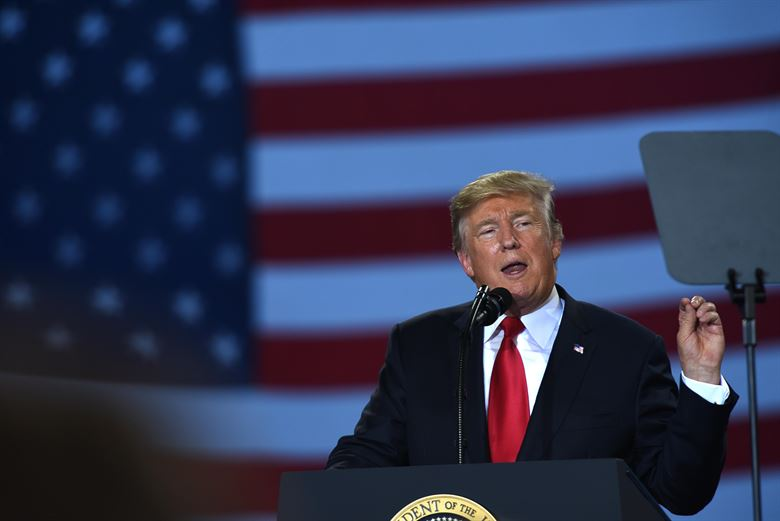
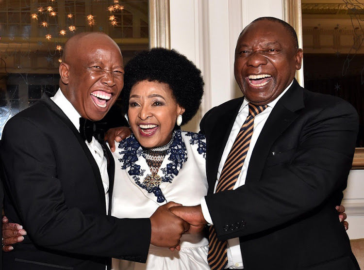
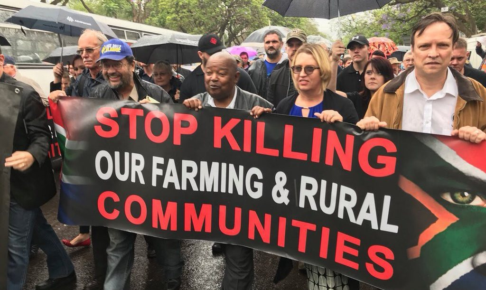

On the 23rd of August 2018, US President Donald Trump announced on Twitter that he had instructed Secretary of State Mike Pompeo to “closely study the South Africa land and farm seizures and expropriations and the large scale killing of farmers.” In this tweet, Trump also referred to Fox News commentator Tucker Carlson, who devoted a six-minute segment on his show to commenting on proposed land reforms in South Africa that were supposedly designed to expropriate land from white farmers with little or no compensation.

Predictably, Trump’s tweet prompted many angry responses from Twitter users, with some doubting the claim that white farmers have been targeted by the government, and others defending expropriation as a legitimate means of returning land to black South Africans whose ancestors’ lands were themselves expropriated by white Europeans in previous centuries. South Africa President Cyril Ramaphosa, who’s currently leading the charge of land reform and redistribution, has condemned Trump’s tweet as “polarising” and based on “false information”. Ramaphosa denied claims that his government was seeking to expropriate land from white farmers, and in an attempt to alleviate fear among white farmers, his ANC colleague David Masondo claimed that only unused land would be targeted for expropriation. This has done little to calm the debate surrounding land reform in South Africa, and it remains a divisive topic today.

Have Trump and Carlson blown things way out of proportion with regards to the South Africa land reform debate,or are people too eager to dismiss racism against white South Africans because of their hatred of Trump? In this piece we will examine the land reforms that the ANC-led South African government seeks to implement, in addition to claims that South African police are not doing enough to protect white farmers from the rising level of attacks by criminals.

##Land redistribution in post-Apartheid South Africa

Since the end of white-minority rule in 1994, successive South African governments have sought to expand black ownership of land in the country, with proponents of land redistribution pointing out that the land was taken by force from black farmers by white Europeans and arguing that white farmers should no longer benefit from these historical crimes. South African minister Zweli Mkhize said “The land was taken through bloodshed ... Redistribution must take place through the constitution and the law.” He also echoed national sentiment in expressing frustration at the lack of progress being made in land redistribution efforts since 1994, stating “If we don’t raise it [the issue of land redistribution] now, we’ll never have time to.”

Up until recent years, South African governments have sought to redistribute land on a “willing seller, willing buyer” basis; in other words, purchasing land at market value from farmers expressing willingness to sell. This has resulted in a much slower than hoped for pace of redistribution; as of 2017, nearly 75% of farmland in South Africa was owned by whites. Nevertheless, the proposal to expropriate land without compensation is a major escalation in the policy of land redistribution. As well as the perceived slow pace of land redistribution since 1994, another argument given by supporters of this proposal is that South Africa simply doesn’t have the funds to purchase farmland at market price on a large scale, and that expropriation without compensation is the only possible way to increase the speed of land redistribution. We will examine the state of South Africa’s economy in a bit more detail later in this piece, but it is true that the economy has not been doing well in the last few years.

While the government withdrew the bill passed in 2016 aimed at land expropriation well below market price in the aftermath of Trump’s tweet, Ramaphosa reiterated his commitment to addressing the racial disparity in farmland ownership by proposing an amendment to South Africa’s constitution that would grant the government the same power as the scrapped bill would have. While the ANC does not have the two-thirds majority required to pass a constitutional amendment, it has a good chance of achieving this with the support of opposition parties, including the racist and far-left Economic Freedom Fighters (or EFF), led by Julius Malema.

Julius Malema is a divisive figure in South African politics. Formerly the head of the ANC Youth League, he has since gone on to form the EFF, now the third largest party in the South African Parliament. He was convicted of hate speech offences on two occasions and is currently under investigation for a possible third hate speech offence. In June 2018, Malema refused to deny that he was involved in the murders of white farmers and stated that 'We [the EFF] have not called for the killing of white people, at least for now'. With the party in government willing to ally with characters like Malema, it is easy for white farmers and international observers to interpret this development as proof that the government is willing to pursue racist policies to address the racial disparity in land ownership.

##Robert Mugabe’s disastrous 2000 land expropriation policy

Some commentators and critics have argued that expelling white farmers from their land will lead to the same disastrous outcome that befell Zimbabwe after a similar campaign was conducted by Robert Mugabe in 2000. Following the expulsion of thousands of white farmers from their lands in addition to thousands more black employees, Zimbabwe was hit with hyperinflation, capital flight and a collapse in agricultural output. In turn, this resulted in food shortages and a halt in foreign investment coming into the country. Once known as the breadbasket of southern Africa, Zimbabwe continues to feel the negative effects of Mugabe’s racist land reform policies today.

As to whether the South African economy would suffer the same fate its Zimbabwean counterpart, the simple answer is no. While this assault on property rights would increase nervousness among foreign investors, South Africa’s economy is more diversified and therefore less dependent on agriculture. The expropriation of land from white farmers is far less likely to result in extensive food shortages and a crippled economy. Nevertheless, hundreds of thousands of people in the agricultural sector risk unemployment and food inflation may result in food insecurity for lower-income households as a result of expropriation. In addition, South Africa has an unemployment rate of 27% and has just slipped into recession for the first time since 2009. It is unclear how well South Africa would be able to deal with a potential flight of capital, as well as a further reduction in its workforce in the event of mass layoffs resulting from land expropriation.

##Crime against white farmers

The debate surrounding the issue of land redistribution is part of a growing concern among white South Africans that the government is not doing enough to protect them. In addition to the land redistribution debate, crime rates in South Africa remain stubbornly high. Although the murder rate in the country has dropped significantly since 1994, when it hit a peak of roughly 70 murders per 100 people, it has increased slowly but steadily since 2011. Between April 2016 and March 2017, 52 people were murdered every day in South Africa. This increase is roughly in line with the number of murders that have occurred on white-owned farms, and government sources have maintained that the rate of murders on white-owned farms does not reflect a higher rate of discrimination on white South Africans in general.

Nevertheless, it is distressing to read stories of elderly couples being the victim of robbery, torture and murder, apparently being targeted for the colour of their skin as well as the isolated location of their farms. This has prompted politicians from countries including Australia and Russia, to call for granting refugee status to white South African farmers. In March 2018, Australian Home Affairs Minister Peter Dutton called for white South African farmers to be given “special attention” in their asylum applications and other Liberal Party MPs have called for a special intake of up to 10,000 South Africans. This has been condemned by Australian Green Party Leader Richard Di Natale as a “return to the White Australia policy”. Russian state media has reported that up to 15,000 white South Africans are seeking to flee the country into Russia, where farmland is apparently plentiful. While the veracity of this report is questionable, it nevertheless paints a dark picture for the future of white farmers in South Africa that must be taken seriously, especially now that the ANC-led government is seeking to increase the pace of land redistribution through any means possible including allying with an unashamedly racist party in the EFF.

##Trump and his army of haters and defenders

After apparently watching Fox News commentator Tucker Carlson’s report on the situation in South Africa, Trump has asked State Secretary Mike Pompeo to keep him updated on the situation over there. For such a minor intervention, the world’s response has been visceral. Predictable accusations of racism flew in the aftermath of his tweet, but many have also been quick to defend Trump, and decry the situation in South Africa as the beginning stage of a supposed “white genocide” that the South African government is seeking to perpetrate.

It is laughable to criticise this intervention by Trump as being “racist”, when at its core it seeks to prevent a foreign government from committing racist acts against its own citizens. While Trump is unlikely to be fully informed of the situation in South Africa, it is even less likely that his reason for intervening is due to racism against black people. The fact is that the South African government is seriously considering measures aimed at land redistribution that, at best, will disproportionately affect white farmers, and deliberately target them at worst. It is overly simplistic and wrong-minded for anyone to claim that racism against black people is Trump’s sole motivator in this particular issue.

The cohorts of Trump defenders and white supremacists claiming “white genocide” are also guilty of exaggerating and mischaracterising the South African government’s intentions. As examined already in this piece, the number of murders on white-owned farms does not in itself indicate a rising level of black racial animosity against whites in South Africa. Instead, the rise in the number of murders on white-owned farms is accompanies by a similar rise in murder rates across racial groups in South Africa. However, this is not to say that racist actions against whites do not take place, or that racist rhetoric against whites is never uttered. The utterance of phrases such as “Shoot the Farmer, Kill the Boer” and “Bury them [white farmers] alive!” by mainstream politicians must be condemned by all concerned parties.

##The degradation of political discourse

While it is important to avoid being hyperbolic, it is easy to sense a growing racial tension between the black South African majority and the white farmers who own a clear majority of farmland in the country. While it is important to avoid being hyperbolic, it is easy to sense a growing racial tension between the black South African majority and the white farmers who own a clear majority of farmland in the country. The evidence shows that the increase in attacks against white farmers corresponds with an overall rise in South Africa’s murder rate. However, it is deeply concerning for many that the government seems willing to ally with an openly racist party in order to pass a constitutional amendment that is arguably racist in its intentions itself.

Additionally, the amount of criticism being levied at President Trump for merely requesting the Secretary of State to find out more about the situation in South Africa can be explained by people's prior hatred of him, rather than a real concern for the plight of the black majority in the country. The level of hysterical attacks we have witnessed being levied against an innocuous tweet, especially by Trump’s standards, underscores the level of hostility the President faces, albeit very often rightly. What we have witnessed in this case is a microcosm of what is wrong with political discourse in western societies in general, and the US in particular. The failure of mainstream media, independent media, and countless citizens to separate issues from personalities represents a sickness in political discourse. Whether this sickness is simply a flu that will pass relatively quickly, or a cancer that will only worsen, remains to be seen.
