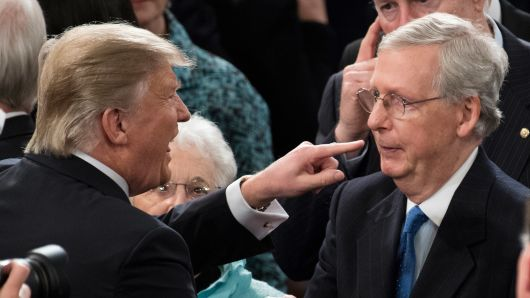

Since the Republican party won the US congressional and presidential elections in 2016, they have made a renewed push for tax cuts designed to benefit wealthy Americans, and have just passed another round of tax cuts. President Donald Trump has claimed that these tax cuts “will be the biggest in the history of our country”. Secretary of the Treasury, Steven Mnuchin has echoed this claim, although evidence has suggested otherwise. Nevertheless, this strategy of cutting taxes for wealthy Americans in the hopes of stimulating the economy is not a new one, and the current plan seeks to continue the “trickle-down economics” once espoused by Ronald Reagan. In this piece, we’ll examine two states that have attempted similar tax cuts in recent years, and also take a look at previous tax cuts made by Reagan and Bush. We’ll then compare them with the current tax plan and analyse what impacts it will have.

President Donald Trump and GOP Senate leader Mitch McConnell.

##Tax cuts have had mixed results in North Carolina

Since 2013, the Republican party in North Carolina have passed successive budgets aimed at cutting income and corporate tax rates, as well as abolishing estate tax entirely. Conservatives hold up North Carolina as a shining example low taxation resulting in economic growth and prosperity. Contributor for the “National Review”, Akash Chougule, has claimed that the tax cuts in North Carolina have enabled the economy to grow at a faster pace, and allow businesses to hire more people. As a result, more people are paying taxes because they have found jobs, essentially allowing the tax cuts to pay for themselves.

However, this analysis doesn’t square with what economists have said about North Carolina’s recent tax cuts. The impact of these cuts on the state’s budget will take longer to manifest than a few years, they claim. What we may well end up seeing is a reduction in public services, government employees working longer hours for less pay, and less infrastructure maintenance among other things. In particular, professor of Economics at Elon University, Steve Deloach, is concerned over the fact that education cuts during the Great Recession haven’t been reversed, and that in future decades, North Carolina may suffer from a lack of high quality education in its workforce.

The small business owners in North Carolina that were supposedly the main beneficiaries of the tax cuts have reported that while their businesses have been performing well, it has been less as a result of the tax cuts, and more likely the result of the US economy doing well as a whole. As well as this, the improvements they had seen were still not enough to hire more staff or give raises to their current staff. In addition, the same business owners echoed economists concerns that the reduction in spending on public services would have a detrimental effect in the long term. Eric Henry, a t-shirt manufacturer featured in the Washington Post, commented that “I don’t know the people who this [tax cut] benefits”.

Businesses are reporting minimal benefits, and we haven’t yet seen the full impact of spending cuts on education, but analysts and citizens alike fear a reduction of the quality of public services such as education and infrastructure in North Carolina. The best way to sum up the result of the tax cuts in North Carolina, is to say that they are, at best, mixed. If North Carolina is the model of success for the federal government to follow in terms of cutting taxes, the average American doesn’t stand to see many benefits, if any.

##Tax cut “experiment” in Kansas has gone disastrously wrong

Meanwhile in Kansas, the tax cut experiment has been nothing short of a disaster. The Republican-led state government passed a bill aimed at enabling wealthy Kansans to pay less taxes by funneling their income to a “pass-through” entities like charities or limited liability companies. At the time of signing the tax cuts into law, the governor of Kansas, Sam Brownback, and his revenue secretary, Nick Jordan made three concrete promises about what the tax cuts would achieve. The first was that jobs would increase by 22,000 more than would have been the case under the previous tax regime. The second promise was that the population would increase by 35,000, and the last promise was that the state government would have over $2bn in the next few years.

By the governor’s own terms, the tax cuts failed miserably. The rate of job growth not only failed to grow faster, but actually declined in the last few years. In addition, population growth slowed when compared to the previous four years. Nevertheless, Governor Brownback stubbornly refused to alter course, despite the obvious failure of his “experiment”. It took a bipartisan vote to thwart his veto of a return to the previous tax regime, and was an excellent opportunity for President Trump to realise that tax cuts for the wealthy do not help most Americans. However, Trump and the GOP rushed to pass the tax cuts before the end of the year, with little regard for the results of previous tax cuts at the state level.

Trump and the GOP have shown time and time again that they care little for reality. The reality in this particular case is that tax cuts for corporations and wealthy people do not help the majority of Americans in the long term. Ronald Reagan cut the top income tax rate drastically and cut the corporate tax rate, resulting in an end to the 1980 Recession. However, he also increased government spending (primarily in defense) and massively increased the deficit. Economists agree that Reagan’s economic policies, while useful in the early 80s, would not work today. In an effort to combat recession and rising unemployment, George W Bush cut corporate tax rates and income taxes for the rich. Each tax cut gave the rich more disposable income,but this did not trickle down to ordinary Americans, as the GOP claimed they would. In fact, as a result of these tax cuts, income inequality is worse than ever before in the US. The economy is growing, but outside of the top 1% of earners, people aren’t seeing the benefits of this growth.

##Why is the GOP so determined to keep cutting taxes for the rich?

Trickle-down economics have been a hallmark of Republican policy since the 1980s, and despite obvious negative consequences for the average American like wage stagnation and cuts to public services, the GOP looks set to pass yet another round of tax cuts for wealthy Americans.  President Trump has claimed that the cuts will result in the economy growing at a much faster rate, though experts have refuted this claim. Support for the Trump’s plan is lower than previous tax cuts, a fact acknowledged by Speaker of the House, Paul Ryan. Nevertheless, he has expressed the belief that once the cuts take effect, people will view them in a more positive light. This is in spite of an abundance of evidence showing that the majority of Americans will be negatively affected by the tax cuts in the longer term. So why the insistence by the GOP to cut taxes at every opportunity?

The answer to that requires a piece all on its own, but in Trump’s case, the GOP could well be fearful of a defeat in the midterm elections of 2018. By passing this tax cut bill, they aim to either temporary line the pockets of voters enough to win another election, or work as hard as possible for the benefit of wealthy GOP donors. Either way, when the bill becomes law, it most likely will not be repealed in a hurry, even in the event of a Democratic victory in 2018. As for President Trump specifically, he seeks to tick another completed campaign promise off his list, having already following through promises like pulling the US out of the Trans-Pacific Partnership (or TPP) and recognising Jerusalem as Israel’s capital. In the event of a Democratic victory in 2018, President Trump will find it that much more difficult to set the agenda, and will be forced to devote much of his energy fighting against a hostile legislature.