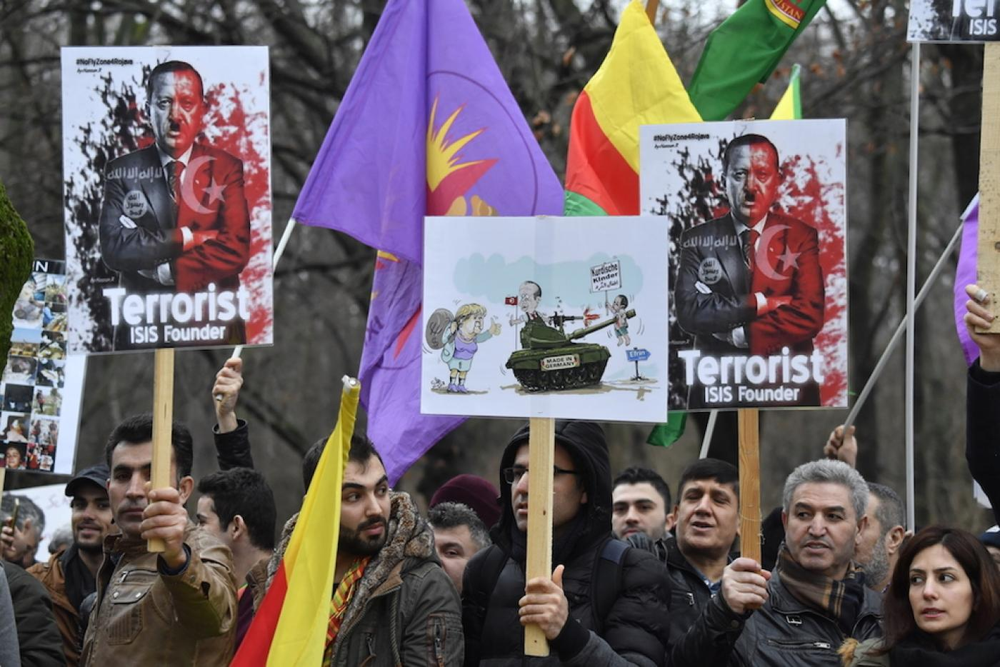

On 16th of January 2018, the US announced its plans to form a 30,000 strong “border force”, made up mostly of fighters in the Syrian Democratic Forces (or SDF), an alliance of Kurdish, Arab and other militias focused on combating ISIS. This force would be stationed across north-eastern Syria to prevent waves of jihadist fighters flooding through Turkey into northern Syria. In previous years, thousands of Islamic extremists traveled from European countries through Turkey and took advantage of Syria’s uncontrolled border. This gave ISIS a huge boost in manpower, and enabled the terrorist group to conduct large scale offensives in Syria and Iraq. With this announcement, the US sought to strengthen the Syrian border and prevent potential jihadist militants from trickling into Syria from Turkey.

However, this move was condemned by virtually every major actor in the Syrian conflict, citing concerns that the US may be helping to cement a Kurdish autonomous territory that would divide the country. No country was stronger in this condemnation than Turkey, which has endured a long-running insurgency in its Kurdish-majority eastern provinces. Just a few days after the announcement, Turkey commenced its first assault on Afrin, a Kurdish enclave in north-western Syria, under the pretext of self-defence from Kurdish nationalist terrorism and ISIS.

The international response to Turkey’s invasion of Afrin has been mixed, and certainly less positive than when Turkey launched its first incursion into Syria (dubbed “Operation Euphrates Shield”). France called for an emergency UN Security Council Meeting over the event and EU diplomatic chief Federica Mogherini stated that she was “extremely worried" about the invasion over risks of civilian casualties and the potential failure of peace talks in Geneva.

In Germany, the response has been even stronger. Upon Turkey’s confirmation that it had deployed German-built tanks into Afrin, Germany suspended its plans to send upgraded tanks to Turkey. A week after Turkey launched its assault into Afrin, 20,000 protesters swept the streets of Cologne in protest against the Turkish campaign (ironically named Operation Olive Branch). Since then, smaller rallies have taken place with hundreds of protesters in cities including Frankfurt and Düsseldorf. Since the suspension of plans to upgrade Turkey’s tanks, debates have raged regarding Germany’s role in conflicts in the Middle East, particularly in Syrian and Yemen.

Activists in Cologne, Germany protesting the Turkish assault on Afrin. 

##Turkish incursions into Syria

This is not the first time Turkey has sent troops into Syria. In response to ISIS losing ground to the SDF, Turkey launched an assault on areas of northern Syria that were soon to fall under the control of the SDF. Allying itself with anti-Assad rebels, Turkey’s main aim was to prevent the SDF from controlling the entirety of Syria’s border with Turkey. After heavy fighting with both ISIS and the SDF, the Turkish-led forces captured some major settlements and prevented the SDF from connecting the Kurdish-majority cantons of Kobani and Afrin. While tactically successful, Turkey’s insistence on equating the US-aligned SDF with ISIS drew international criticism, including from France and Russia.

With this assault, Turkey can no longer keep up the pretence that its focus is on ISIS, as they do not have a presence in Afrin. As such, the international reaction to Turkey’s second invasion of Syria has been decidedly negative. As well as the European response outlined previously, the US also sent mixed messages to Turkey. While the Trump administration attempted to reassure Turkish President Erdogan, the Pentagon cautioned Turkey against aggression. In addition, Russia has condemned the invasion, describing it as “mad”, while the Syrian government has expressed outrage at the offensive, calling it “support for terrorism” due to Turkey’s alliance with anti-Assad rebels.

##The battle so far

In the days before the invasion, Russia withdrew its forces from the region, granting Turkey full control of the air. Since the beginning of the invasion about three weeks ago at the time of writing, the Turkish armed forces, alongside rebel groups, have captured numerous villages in the border area. Thousands of civilians have fled from the advancing forces towards the town of Afrin, and civilians have been killed by all parties in the conflict, including Turkish-backed Syrian rebels and the SDF. In addition, reports of atrocities have emerged, with Turkish border guards opening fire on refugees fleeing towards Turkey, the SDF shelling a mosque in a Turkish town, and the Turkish air force bombing and heavily damaging an ancient temple,constructed thousands of years ago.

Casualties are mounting, and on Saturday the 10th of February, Turkey lost 11 service members who were killed in action. This is despite the fact that anti-Assad rebels have conducted most of the fighting against the SDF. There are conflicting reports on casualty numbers, but it seems clear that at least 29 Turkish soldiers, 165 rebels, and 152 SDF fighters have been killed. This is in addition to at least 74 civilians who have died as a result of the conflict.

SDF fighters in Afrin, Syria.

##Germany’s role

Words alone have not been enough to sway Turkey away from its recent conduct. Turkish President Erdogan declared that the country would not halt its operations in Afrin until all of its objectives had been achieved. As such, leading arms exporter Germany has temporarily halted plans to send upgraded tanks to Turkey. A new government has been formed in Germany, and there is now an ongoing debate regarding the sale of weapons to Turkey, especially given its militarily aggressive strategy in recent years.

Turkey has typically relied on arms deals with the US to strengthen its military, and despite the increasing tension between Turkey and the US, this arrangement is unlikely to change any time soon. However, for decades Turkey has also imported large quantities of weapons from Germany. While the halt on plans to upgrade Turkey’s tanks are not a massive blow to Erdogan’s ambitions, it could signal the potential for Germany to lead other European nations in pressuring Turkey to cease its assault, and find a way to address its security concerns without further bloodshed.

After enduring months of political uncertainty, Germany has a government once again and  can now get to the business of addressing its relationship with Turkey. Under Merkel’s leadership, German-Turkish relations have cooled as a result President Erdogan’s crackdown on dissent in the aftermath of the attempted coup in July 2016. Now, with the Turkish incursion into Afrin, relations between the two countries are threatening to break down further.

Germany has played a hugely important role in the European Union, from the Banking Crisis of 2008, to its agreement with Turkey to stem the tide of refugees in exchange for better living conditions in refugee camps. In addition, it also played a role in the Iran nuclear deal of 2015. Having shown its ability to lead Europe in various crises, Germany can lead the way in pressuring Turkey to cease its operations in Syria, while at the same time addressing Turkish concerns. As well as cancelling its own weapons deals with Turkey, Germany can lobby its allies France and the UK to suspend their own weapons deals, thereby sending a strong signal to Turkey that while the US may tolerate its aggression, European nations will not.

##Why risk Turkish anger?

Turkey is a member of NATO, and is located in a strategically crucial area. In addition, Turkey has the second largest military in NATO, making it an important player in the organisation. After NATO expressed concern at the government’s conduct following the attempted coup of July 2016, Turkey threatened to leave NATO. If it followed through on such a move, it would be a huge blow to NATO interests. So why would western countries even consider speaking out against Turkey’s conduct in Syria? Put simply, granting Turkey a blank cheque to do whatever it pleases could lead to uncertainty, as well as further erosion in trust among partners of western nations.

It is important to state how important the SDF has been in the fight against ISIS. With western support, they have pushed ISIS into a corner and have all but destroyed them. It is important to acknowledge the role of Assad’s forces, but without the SDF, there would have been no organised force on the ground to coordinate with western air power. Turkey’s assault on Afrin is forcing the SDF to divert resources  from their operations against ISIS in other parts of Syria. While ISIS is a shadow of their former selves, they are by no means finished. Turkey’s intervention may be just what ISIS fighters need to get some breathing time, and recover for their next assault.

In addition, it would be a huge blow to western diplomatic credibility if they were to abandon an important ally in its hour of need. The US in particular, rather than condemning this assault, and seeking its end through peaceful means, has instead stood idly by and allowed Turkey to have its way. The rest of the world has seen this, and may well be wary of future dealings with western nations, for fear that they will not keep their word. Germany and its European partners need not fall into the same trap, and with proper coordination, they can put pressure on Turkey to halt its assault.

##Potential European action against Turkey

We’ve already seen Germany suspend its plans to upgrade Turkey’s tanks, and having already approved a £100m fighter jet deal with Turkey, the opportunity is ripe for British Prime Minister Theresa May to take a similar action. Indeed, on the same day the deal was announced, Prime Minister May issued a warning to President Erdogan regarding violations of human rights in Turkey. With some encouragement by Chancellor Merkel, the Prime Minister may be persuaded to cancel or suspend the agreement until Turkey makes efforts to find a peaceful solution to its security concerns. In addition to supporting the SDF, the main force fighting ISIS, the UK would benefit by gaining credibility that was lost by selling weapons to Saudi Arabia, which has itself committed numerous human rights abuses in Yemen.

France would play a smaller role in exerting pressure on Turkey, but by withdrawing from cooperation on defence projects, it would signal to the world that it is taking Turkey’s actions seriously. France has proven that it is not afraid of incurring Turkey’s wrath, having previously passed legislation that would have made the denial of the Armenian genocide a crime. Only the intervention of the country’s supreme court forced the law to be abandoned, rather than the negative Turkish response to the law.

While the US should not be expected to put pressure on Turkey, the current administration could nevertheless take some steps to reassure Turkey’s concerns. In May 2017, President Donald Trump announced that the US would supply the SDF with modern weapons in support of its fight against ISIS, much to Turkey’s alarm. Cancelling this deal, along with the plans to introduce the SDF-led border force, would do much to reassure Turkey’s worries. With three of Europe’s strongest powers taking real action against Turkey’s conduct, as well as the US rolling back material support of the SDF, this carrot and stick approach may well be the best possible way to bring about a peaceful end to the conflict in Afrin and prevent yet another humanitarian disaster in the Middle East.

